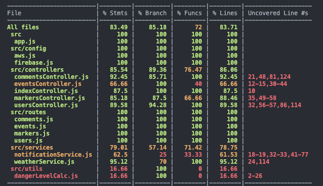
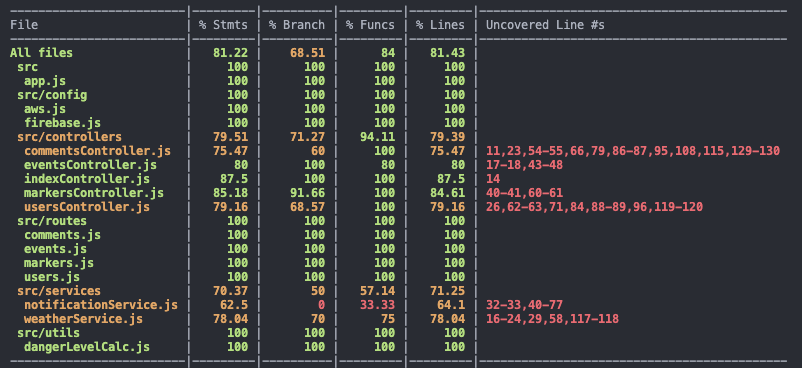
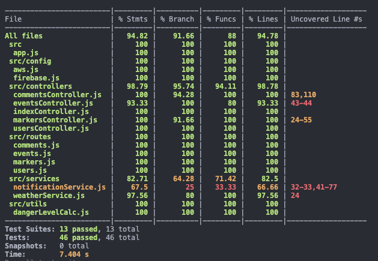

# M6: Testing and Code Review

## 1. Change History

| **Change Date**   | **Modified Sections** | **Rationale** |
| ----------------- | --------------------- | ------------- |
| March 31st | **2. Back-end Test**: Backend File Structure | After M5 Feedback, we refactored our codebase from a monofile to MVCS architecture including folders for config, jobs, services, utils, etc.
| March 31st | **2. Back-end Test**: Mock + Unmocked Test | From refactoring, we recoded our test cases covering not only 500 errors but route and controller specific errors
| April 2nd | **2. Back-end Test**: Instructions and Screenshots | With new test cases, the instructions to run the test are more indepth with new results for the coverage

---

## 2. Back-end Test Specification: APIs

### 2.1. Locations of Back-end Tests and Instructions to Run Them

#### 2.1.1. Tests

| **Interface**                 | **Group Location (No Mocks)** | **Group Location (With Mocks)** | **Mocked Components**               |
| ----------------------------- | ----------------------------- | ------------------------------- | ----------------------------------- |
| **GET /**                     | `tests/unmock/index.test.js`  | `tests/mock/index.test.js`  | None                                |
| **POST /test_cron**           | `tests/unmock/index.test.js`  | `tests/mock/index.test.js`  | axios, External Disaster API        |
| **GET /event**                | `tests/unmock/events.test.js`  | `tests/mock/events.test.js`  | DynamoDB                      |
| **POST /event/custom**        | `tests/unmock/events.test.js`  | `tests/mock/events.test.js`  | DynamoDB, uuid generation       |
| **GET /event/firms**          | `tests/unmock/events.test.js`  | `tests/mock/events.test.js`  | axios, csv-parser                   |
| **POST /comment/:event_id**   | `tests/unmock/comments.test.js`  | `tests/mock/comments.test.js`  | DynamoDB, uuid generation    |
| **GET /comment/:event_id**    | `tests/unmock/comments.test.js`  | `tests/mock/comments.test.js`  | DynamoDB                         |
| **DELETE /comment/:event_id** | `tests/unmock/comments.test.js`  | `tests/mock/comments.test.js`  | DynamoDB  |
| **POST /user**                | `tests/unmock/users.test.js`  | `tests/mock/users.test.js`  | DynamoDB , Firebase Messaging    |
| **GET /user/:user_id**        | `tests/unmock/users.test.js`  | `tests/mock/users.test.js`  | DynamoDB                         |
| **POST /user/locations**      | `tests/unmock/users.test.js`  | `tests/mock/users.test.js`  | DynamoDB                      |
| **POST /user_marker**      | `tests/unmock/markers.test.js`  | `tests/mock/marker.test.js`  | DynamoDB                      |
| **GET /user_marker**      | `tests/unmock/markers.test.js`  | `tests/mock/marker.test.js`  | axios, DynamoDB                  |

#### 2.1.2. Commit Hash Where Tests Run

`919ac261bda4ada7aa9d69e0ec2152c29e619d50`

#### 2.1.3. Explanation on How to Run the Tests

**Clone the Repository**:

1. Clone the Repository:
    ```bash
    git clone https://github.com/migies12/TempestMap.git
    ```

2. Build and Run Tests:
    ```bash
    cd backend
    npm install
    npm run test
    ```
    NOTE: For the test to run, you need to config a Firebase Messaging Service in order to run the tests. This requires a special .json file, placed where the "example-firebase-admin.json" file is located. A properly formatted .env file also needs to be present, in the same format as env.example. Please contact the team for environment files when needed, this may be available along with the canvas submission.


### 2.2. GitHub Actions Configuration Location

`~/.github/workflows/backend-test.yml`

### 2.3. Jest Coverage Report Screenshots With Mocks


### 2.4. Jest Coverage Report Screenshots Without Mocks



### 2.5. Jest Coverage Report Full Test



### 2.6  Reasoning For Files with < 100% coverage

- `notificationService`: The firebase notification service is unable to be mocked for certain failure scenarios hindering the statement coverage for the code


---

## 3. Tests of Non-Functional Requirements

### 3.1. Test Locations in Git

| **Non-Functional Requirement**   | **Location in Git**                                                                                                                                                                                                             |
| -------------------------------- | ------------------------------------------------------------------------------------------------------------------------------------------------------------------------------------------------------------------------------- |
| **Accessibility Compliance**     | [`frontend/app/src/androidTest/java/com/example/m1/nonfunctional/AccessibilityTest.kt`](https://github.com/migies12/TempestMap/blob/main/frontend/app/src/androidTest/java/com/example/m1/nonfunctional/AccessibilityTest.kt)   |
| **Ease of Use (Error Handling)** | [`frontend/app/src/androidTest/java/com/example/m1/nonfunctional/ErrorHandlingTests.kt`](https://github.com/migies12/TempestMap/blob/main/frontend/app/src/androidTest/java/com/example/m1/nonfunctional/ErrorHandlingTests.kt) |

### 3.2. Test Verification and Logs

- **Accessibility Compliance**

  - **Verification:** This test suite verifies compliance with [WCAG 2.1 Level AA accessibility standards](https://www.w3.org/TR/WCAG21/) using automated testing with Espresso and AccessibilityChecks. The tests validate three key aspects of accessibility: (1) proper content descriptions for screen reader compatibility, (2) color contrast ratios that meet minimum thresholds, and (3) touch target sizes of at least 44dp to ensure usability for individuals with motor impairments. The logs record detailed metrics for each test, including exact color values, contrast ratios, element dimensions, and content description presence. Since there is a clear measurable metric that is measured during the test process, if at any point the measure violates the accessibility standards, the test will fail, and the exact measure will be indicated in the log accordingly.
  - **Log Output**

    ```
    ---------------------------- PROCESS STARTED (29766) for package com.example.m1 ----------------------------
    2025-03-12 17:14:30.782 29766-29796 TestRunner              com.example.m1                       I  started: testTouchTargetSize(com.example.m1.nonfunctional.AccessibilityTest)
    2025-03-12 17:14:31.407 29766-29796 AccessibilityTest       com.example.m1                       D  ================================
    2025-03-12 17:14:31.430 29766-29796 AccessibilityTest       com.example.m1                       D  Starting Accessibility Test
    2025-03-12 17:14:31.432 29766-29796 AccessibilityTest       com.example.m1                       D  ================================
    2025-03-12 17:14:31.438 29766-29796 AccessibilityTest       com.example.m1                       D  Accessibility checks enabled
    2025-03-12 17:14:31.442 29766-29796 AccessibilityTest       com.example.m1                       D  Starting touch target size test
    2025-03-12 17:14:31.659 29766-29796 AccessibilityTest       com.example.m1                       D  Navigating to map screen
    2025-03-12 17:14:32.389 29766-29796 AccessibilityTest       com.example.m1                       D  Checking touch target size for add marker button
    2025-03-12 17:14:32.393 29766-29766 AccessibilityTest       com.example.m1                       D  Touch target size check for fabAddMarker: width=147px, height=147px, min required=115.5px - PASS
    2025-03-12 17:14:32.395 29766-29796 AccessibilityTest       com.example.m1                       D  Touch target size test completed
    2025-03-12 17:14:32.397 29766-29796 TestRunner              com.example.m1                       I  finished: testTouchTargetSize(com.example.m1.nonfunctional.AccessibilityTest)
    2025-03-12 17:14:32.607 29766-29796 TestRunner              com.example.m1                       I  started: testTextContrast(com.example.m1.nonfunctional.AccessibilityTest)
    2025-03-12 17:14:32.838 29766-29796 AccessibilityTest       com.example.m1                       D  ================================
    2025-03-12 17:14:32.840 29766-29796 AccessibilityTest       com.example.m1                       D  Starting Accessibility Test
    2025-03-12 17:14:32.841 29766-29796 AccessibilityTest       com.example.m1                       D  ================================
    2025-03-12 17:14:32.843 29766-29796 AccessibilityTest       com.example.m1                       D  Accessibility checks enabled
    2025-03-12 17:14:32.844 29766-29796 AccessibilityTest       com.example.m1                       D  Starting text contrast test
    2025-03-12 17:14:33.044 29766-29766 AccessibilityTest       com.example.m1                       D  Scanning view hierarchy for text contrast issues
    2025-03-12 17:14:33.046 29766-29766 AccessibilityTest       com.example.m1                       D  TextView contrast check: View(MaterialTextView@81924395) - text color: #FF49454F, bg color: #FFFFFBFE, size: 14.095238dp, ratio: 9.11, required: 4.5 - PASS
    2025-03-12 17:14:33.047 29766-29766 AccessibilityTest       com.example.m1                       D  TextView contrast check: navigation_bar_item_small_label_view - text color: #FF1C1B1F, bg color: #FFFFFBFE, size: 12.190476dp, ratio: 16.71, required: 4.5 - PASS
    2025-03-12 17:14:33.049 29766-29766 AccessibilityTest       com.example.m1                       D  TextView contrast check: navigation_bar_item_large_label_view - text color: #FF1C1B1F, bg color: #FFFFFBFE, size: 12.190476dp (bold), ratio: 16.71, required: 4.5 - PASS
    2025-03-12 17:14:33.050 29766-29766 AccessibilityTest       com.example.m1                       D  TextView contrast check: navigation_bar_item_small_label_view - text color: #FF49454F, bg color: #FFFFFBFE, size: 12.190476dp, ratio: 9.11, required: 4.5 - PASS
    2025-03-12 17:14:33.052 29766-29766 AccessibilityTest       com.example.m1                       D  TextView contrast check: navigation_bar_item_large_label_view - text color: #FF49454F, bg color: #FFFFFBFE, size: 12.190476dp (bold), ratio: 9.11, required: 4.5 - PASS
    2025-03-12 17:14:33.056 29766-29766 AccessibilityTest       com.example.m1                       D  TextView contrast check: navigation_bar_item_small_label_view - text color: #FF49454F, bg color: #FFFFFBFE, size: 12.190476dp, ratio: 9.11, required: 4.5 - PASS
    2025-03-12 17:14:33.058 29766-29766 AccessibilityTest       com.example.m1                       D  TextView contrast check: navigation_bar_item_large_label_view - text color: #FF49454F, bg color: #FFFFFBFE, size: 12.190476dp (bold), ratio: 9.11, required: 4.5 - PASS
    2025-03-12 17:14:33.059 29766-29766 AccessibilityTest       com.example.m1                       D  TextView contrast check: navigation_bar_item_small_label_view - text color: #FF49454F, bg color: #FFFFFBFE, size: 12.190476dp, ratio: 9.11, required: 4.5 - PASS
    2025-03-12 17:14:33.060 29766-29766 AccessibilityTest       com.example.m1                       D  TextView contrast check: navigation_bar_item_large_label_view - text color: #FF49454F, bg color: #FFFFFBFE, size: 12.190476dp (bold), ratio: 9.11, required: 4.5 - PASS
    2025-03-12 17:14:33.062 29766-29766 AccessibilityTest       com.example.m1                       D  Text contrast check completed. Passing views: 9, Failing views: 0
    2025-03-12 17:14:33.064 29766-29796 AccessibilityTest       com.example.m1                       D  Text contrast test completed
    2025-03-12 17:14:33.065 29766-29796 TestRunner              com.example.m1                       I  finished: testTextContrast(com.example.m1.nonfunctional.AccessibilityTest)
    2025-03-12 17:14:33.174 29766-29796 TestRunner              com.example.m1                       I  started: testContentDescriptions(com.example.m1.nonfunctional.AccessibilityTest)
    2025-03-12 17:14:33.406 29766-29796 AccessibilityTest       com.example.m1                       D  ================================
    2025-03-12 17:14:33.409 29766-29796 AccessibilityTest       com.example.m1                       D  Starting Accessibility Test
    2025-03-12 17:14:33.414 29766-29796 AccessibilityTest       com.example.m1                       D  ================================
    2025-03-12 17:14:33.419 29766-29796 AccessibilityTest       com.example.m1                       D  Accessibility checks enabled
    2025-03-12 17:14:33.421 29766-29796 AccessibilityTest       com.example.m1                       D  Starting content descriptions test
    2025-03-12 17:14:33.637 29766-29796 AccessibilityTest       com.example.m1                       D  Checking content description for Home Navigation (ID: 2131362175)
    2025-03-12 17:14:33.641 29766-29766 AccessibilityTest       com.example.m1                       D  Content description check for nav_home: "Home" - PASS
    2025-03-12 17:14:33.642 29766-29796 AccessibilityTest       com.example.m1                       D  Checking content description for Map Navigation (ID: 2131362177)
    2025-03-12 17:14:33.648 29766-29766 AccessibilityTest       com.example.m1                       D  Content description check for nav_map: "Map" - PASS
    2025-03-12 17:14:33.649 29766-29796 AccessibilityTest       com.example.m1                       D  Checking content description for Profile Navigation (ID: 2131362178)
    2025-03-12 17:14:33.652 29766-29766 AccessibilityTest       com.example.m1                       D  Content description check for nav_profile: "Profile" - PASS
    2025-03-12 17:14:33.653 29766-29796 AccessibilityTest       com.example.m1                       D  Checking content description for Alerts Navigation (ID: 2131362173)
    2025-03-12 17:14:33.656 29766-29766 AccessibilityTest       com.example.m1                       D  Content description check for nav_alerts: "Alerts" - PASS
    2025-03-12 17:14:33.658 29766-29796 AccessibilityTest       com.example.m1                       D  Content descriptions test completed
    2025-03-12 17:14:33.659 29766-29796 TestRunner              com.example.m1                       I  finished: testContentDescriptions(com.example.m1.nonfunctional.AccessibilityTest)
    ---------------------------- PROCESS ENDED (29766) for package com.example.m1 ----------------------------
    ```

- **Ease of Use (Error Handling)**
  - **Verification:** This test suite checks the error handling capabilities of the app, specifically in the profile sector. It does so by simulating a network failure on the Profile page and expects the app to display a clear error message with a retry option. Additionally, the test simulates invalid user input (e.g., an incorrect email format) to verify proper error handling for invalid user input cases. Lastly, whenever an error occurs, user input is expected to be preserved; the tests ensure that is the case. We run the test with detailed logs shown below to capture every step of the test.
  - **Log Output**
  ```
  2025-03-16 20:24:01.577 17772-17816 TestRunner              com.example.m1                       I  started: testFormDataPreservationOnError(com.example.m1.nonfunctional.ErrorHandlingTests)
  2025-03-16 20:24:02.594 17772-17816 ErrorHandlingTests      com.example.m1                       D  Starting ErrorHandlingTests setup
  2025-03-16 20:24:02.666 17772-17816 ErrorHandlingTests      com.example.m1                       D  UserPrefs set
  2025-03-16 20:24:02.669 17772-17816 ErrorHandlingTests      com.example.m1                       D  Starting testFormDataPreservationOnError
  2025-03-16 20:24:03.433 17772-17816 ErrorHandlingTests      com.example.m1                       D  Clicked nav_profile
  2025-03-16 20:24:08.511 17772-17816 ErrorHandlingTests      com.example.m1                       D  Profile info filled
  2025-03-16 20:24:08.526 17772-17816 ErrorHandlingTests      com.example.m1                       D  Filled profile info
  2025-03-16 20:24:12.197 17772-17816 ErrorHandlingTests      com.example.m1                       D  simulateNoNetwork executed
  2025-03-16 20:24:12.217 17772-17816 ErrorHandlingTests      com.example.m1                       D  Network disabled
  2025-03-16 20:24:15.320 17772-17816 ErrorHandlingTests      com.example.m1                       D  Scrolled using UiScrollable
  2025-03-16 20:24:15.322 17772-17816 ErrorHandlingTests      com.example.m1                       D  Scrolled to save button
  2025-03-16 20:24:16.419 17772-17816 ErrorHandlingTests      com.example.m1                       D  Clicked save_button
  2025-03-16 20:24:18.007 17772-17816 ErrorHandlingTests      com.example.m1                       D  Network error dialog displayed
  2025-03-16 20:24:18.399 17772-17816 ErrorHandlingTests      com.example.m1                       D  Clicked Retry in dialog
  2025-03-16 20:24:21.540 17772-17816 ErrorHandlingTests      com.example.m1                       D  Form fields verified via UiDevice
  2025-03-16 20:24:21.544 17772-17816 ErrorHandlingTests      com.example.m1                       D  Form fields verified
  2025-03-16 20:24:24.609 17772-17816 ErrorHandlingTests      com.example.m1                       D  restoreNetwork executed
  2025-03-16 20:24:24.628 17772-17816 ErrorHandlingTests      com.example.m1                       D  Network restored
  2025-03-16 20:24:26.665 17772-17816 ErrorHandlingTests      com.example.m1                       D  Completed testFormDataPreservationOnError
  2025-03-16 20:24:26.892 17772-17816 TestRunner              com.example.m1                       I  finished: testFormDataPreservationOnError(com.example.m1.nonfunctional.ErrorHandlingTests)
  2025-03-16 20:24:27.011 17772-17816 TestRunner              com.example.m1                       I  started: testInvalidInputHandling(com.example.m1.nonfunctional.ErrorHandlingTests)
  2025-03-16 20:24:27.371 17772-17816 ErrorHandlingTests      com.example.m1                       D  Starting ErrorHandlingTests setup
  2025-03-16 20:24:27.380 17772-17816 ErrorHandlingTests      com.example.m1                       D  UserPrefs set
  2025-03-16 20:24:27.382 17772-17816 ErrorHandlingTests      com.example.m1                       D  Starting testInvalidInputHandling
  2025-03-16 20:24:27.798 17772-17816 ErrorHandlingTests      com.example.m1                       D  Clicked nav_profile
  2025-03-16 20:24:30.687 17772-17816 ErrorHandlingTests      com.example.m1                       D  Entered invalid email
  2025-03-16 20:24:32.066 17772-17816 ErrorHandlingTests      com.example.m1                       D  Initial save_button click failed, trying alternate method
  2025-03-16 20:24:34.810 17772-17816 ErrorHandlingTests      com.example.m1                       D  UiDevice clicked Save Profile
  2025-03-16 20:24:37.876 17772-17816 ErrorHandlingTests      com.example.m1                       D  Re-entered valid email
  2025-03-16 20:24:39.433 17772-17816 ErrorHandlingTests      com.example.m1                       D  Scrolled using UiScrollable
  2025-03-16 20:24:40.418 17772-17816 ErrorHandlingTests      com.example.m1                       D  Clicked save_button after correcting email
  2025-03-16 20:24:41.126 17772-17816 ErrorHandlingTests      com.example.m1                       D  Completed testInvalidInputHandling
  2025-03-16 20:24:41.386 17772-17816 TestRunner              com.example.m1                       I  finished: testInvalidInputHandling(com.example.m1.nonfunctional.ErrorHandlingTests)
  ```

---

## 4. Front-end Test Specification

### 4.1. Location in Git of Front-end Test Suite:

These tests can be found in `frontend/app/src/androidTest/java/com/example/m1`. The files in which the tests are present are "CustomMarkerTests", "FavoriteLocationTests", and "NotificationTests".

### 4.2. Tests

**It is crucial that for all of these tests, animations are turned off in developer options. For more information, please look [here](https://developer.android.com/training/testing/espresso/setup#set-up-environment)**

- **Use Case: Add Custom Marker**

  - **Expected Behaviors:**

    | **Scenario Steps** | **Test Case Steps** |
    | ------------------ | ------------------- |
    | 1. User clicks the "Add Marker" button | Navigate to the map page, click the button to open dialog selection. Select options and input title for marker |
    | 1a. User is not Registered | Change sharedPreferences to simulate a signed-out user |
    | 1a1. System displays an error message: "You must be logged in to add markers" | Ensure AlertDialog appears on the screen |
    | 1a2. User is redirected to login screen | Click yes on the log-in prompt, and ensure the sign-in page is loaded |
    | 2. User places marker on the map | Click on the screen |
    | 3. User selects a marker type (safehouse, resource point, danger) and enters a short description | Enter a description for the marker |
    | 4. User selects "Create Marker" | Click the "Create Marker" button. |
    | 5. System saves the marker and displays it on the map | Click in the same spot we clicked to set the marker, and assert that we open the marker matching the description we entered earlier |

  - **Test Logs:**
    ```
    2025-03-17 13:22:54: Launching CustomMarkerTests on 'Medium Phone API 35.
    Running tests
    Executing tasks: [:app:connectedDebugAndroidTest] in project C:\Users\User\AndroidStudioProjects\TempestMap2\frontend


    > Configure project :app
    AGPBI: {"kind":"warning","text":"The option setting 'android.experimental.testOptions.emulatorSnapshots.maxSnapshotsForTestFailures=0' is experimental.","sources":[{}]}

    > Task :app:checkKotlinGradlePluginConfigurationErrors SKIPPED
    > Task :app:preBuild UP-TO-DATE
    > Task :app:preDebugBuild UP-TO-DATE
    > Task :app:dataBindingMergeDependencyArtifactsDebug UP-TO-DATE
    > Task :app:generateDebugResValues UP-TO-DATE
    > Task :app:generateDebugResources UP-TO-DATE
    > Task :app:processDebugGoogleServices UP-TO-DATE
    > Task :app:mergeDebugResources UP-TO-DATE
    > Task :app:packageDebugResources UP-TO-DATE
    > Task :app:parseDebugLocalResources UP-TO-DATE
    > Task :app:dataBindingGenBaseClassesDebug UP-TO-DATE
    > Task :app:generateDebugBuildConfig UP-TO-DATE
    > Task :app:checkDebugAarMetadata UP-TO-DATE
    > Task :app:mapDebugSourceSetPaths UP-TO-DATE
    > Task :app:createDebugCompatibleScreenManifests UP-TO-DATE
    > Task :app:extractDeepLinksDebug UP-TO-DATE
    > Task :app:processDebugMainManifest UP-TO-DATE
    > Task :app:processDebugManifest UP-TO-DATE
    > Task :app:processDebugManifestForPackage UP-TO-DATE
    > Task :app:processDebugResources UP-TO-DATE
    > Task :app:kaptGenerateStubsDebugKotlin UP-TO-DATE
    > Task :app:kaptDebugKotlin UP-TO-DATE
    > Task :app:compileDebugKotlin UP-TO-DATE
    > Task :app:javaPreCompileDebug UP-TO-DATE
    > Task :app:compileDebugJavaWithJavac UP-TO-DATE
    > Task :app:bundleDebugClassesToCompileJar UP-TO-DATE
    > Task :app:preDebugAndroidTestBuild SKIPPED
    > Task :app:dataBindingMergeDependencyArtifactsDebugAndroidTest UP-TO-DATE
    > Task :app:generateDebugAndroidTestResValues UP-TO-DATE
    > Task :app:generateDebugAndroidTestResources UP-TO-DATE
    > Task :app:mergeDebugAndroidTestResources UP-TO-DATE
    > Task :app:dataBindingGenBaseClassesDebugAndroidTest UP-TO-DATE
    > Task :app:processDebugAndroidTestManifest UP-TO-DATE
    > Task :app:generateDebugAndroidTestBuildConfig UP-TO-DATE
    > Task :app:checkDebugAndroidTestAarMetadata UP-TO-DATE
    > Task :app:mapDebugAndroidTestSourceSetPaths UP-TO-DATE
    > Task :app:processDebugAndroidTestResources UP-TO-DATE
    > Task :app:javaPreCompileDebugAndroidTest UP-TO-DATE
    > Task :app:mergeDebugShaders UP-TO-DATE
    > Task :app:compileDebugShaders NO-SOURCE
    > Task :app:generateDebugAssets UP-TO-DATE
    > Task :app:mergeDebugAssets UP-TO-DATE
    > Task :app:compressDebugAssets UP-TO-DATE
    > Task :app:processDebugJavaRes UP-TO-DATE
    > Task :app:mergeDebugJavaResource UP-TO-DATE
    > Task :app:checkDebugDuplicateClasses UP-TO-DATE
    > Task :app:desugarDebugFileDependencies UP-TO-DATE
    > Task :app:mergeExtDexDebug UP-TO-DATE
    > Task :app:mergeLibDexDebug UP-TO-DATE
    > Task :app:dexBuilderDebug UP-TO-DATE
    > Task :app:mergeProjectDexDebug UP-TO-DATE
    > Task :app:mergeDebugJniLibFolders UP-TO-DATE
    > Task :app:mergeDebugNativeLibs UP-TO-DATE
    > Task :app:stripDebugDebugSymbols UP-TO-DATE
    > Task :app:validateSigningDebug UP-TO-DATE
    > Task :app:writeDebugAppMetadata UP-TO-DATE
    > Task :app:writeDebugSigningConfigVersions UP-TO-DATE
    > Task :app:packageDebug UP-TO-DATE
    > Task :app:createDebugApkListingFileRedirect UP-TO-DATE
    > Task :app:mergeDebugAndroidTestShaders UP-TO-DATE
    > Task :app:compileDebugAndroidTestShaders NO-SOURCE
    > Task :app:generateDebugAndroidTestAssets UP-TO-DATE
    > Task :app:mergeDebugAndroidTestAssets UP-TO-DATE
    > Task :app:compressDebugAndroidTestAssets UP-TO-DATE
    > Task :app:checkDebugAndroidTestDuplicateClasses UP-TO-DATE
    > Task :app:desugarDebugAndroidTestFileDependencies UP-TO-DATE
    > Task :app:mergeExtDexDebugAndroidTest UP-TO-DATE
    > Task :app:mergeLibDexDebugAndroidTest UP-TO-DATE
    > Task :app:mergeDebugAndroidTestJniLibFolders UP-TO-DATE
    > Task :app:mergeDebugAndroidTestNativeLibs NO-SOURCE
    > Task :app:stripDebugAndroidTestDebugSymbols NO-SOURCE
    > Task :app:validateSigningDebugAndroidTest UP-TO-DATE
    > Task :app:writeDebugAndroidTestSigningConfigVersions UP-TO-DATE

    > Task :app:kaptGenerateStubsDebugAndroidTestKotlin
    w: Support for language version 2.0+ in kapt is in Alpha and must be enabled explicitly. Falling back to 1.9.

    > Task :app:kaptDebugAndroidTestKotlin UP-TO-DATE
    > Task :app:compileDebugAndroidTestKotlin
    > Task :app:compileDebugAndroidTestJavaWithJavac UP-TO-DATE
    > Task :app:processDebugAndroidTestJavaRes UP-TO-DATE
    > Task :app:mergeDebugAndroidTestJavaResource UP-TO-DATE
    > Task :app:dexBuilderDebugAndroidTest
    > Task :app:mergeProjectDexDebugAndroidTest
    > Task :app:packageDebugAndroidTest
    > Task :app:createDebugAndroidTestApkListingFileRedirect UP-TO-DATE
    Connected to process 12482 on device 'Medium_Phone_API_35 [emulator-5554]'.

    > Task :app:connectedDebugAndroidTest
    Starting 2 tests on Medium_Phone_API_35(AVD) - 15

    Medium_Phone_API_35(AVD) - 15 Tests 0/2 completed. (0 skipped) (0 failed)
    Medium_Phone_API_35(AVD) - 15 Tests 1/2 completed. (0 skipped) (0 failed)
    Medium_Phone_API_35(AVD) - 15 Tests 2/2 completed. (0 skipped) (0 failed)
    Finished 2 tests on Medium_Phone_API_35(AVD) - 15

    BUILD SUCCESSFUL in 43s
    74 actionable tasks: 6 executed, 68 up-to-date

    Build Analyzer results available
    ```

- **Use Case: Save Location to Favorites**

  - **Expected Behaviors:**

    | **Scenario Steps** | **Test Case Steps** |
    | ------------------ | ------------------- |
    | 1. User clicks on a location on the map | Navigate to the map page and click on the map |
    | 1a. User is not registered | Change sharedPreferences to simulate a signed-out user |
    | 1a1. System displays an error message: "Location saved to Favorites" | Assert AlertDialog appear on screen |
    | 1a2. User is redirected to login screen | Click yes on the log-in prompt, and ensure the sign-in page is loaded |
    | 2. User clicks the "Save to Favorites" button  | Click on the Save to Favorites button |
    | 3. System saves the location to the user's Favorites list | Check user's Favorites list to ensure test marker has been added |
    | 4. User receives a confirmation message: "Location saved to Favorites" | Ensure Snackbar apears on screen with text matching "Location saved to Favorites" |

  - **Test Logs:**
    ```
    2025-03-17 13:33:14: Launching FavoriteLocationTests on 'Medium Phone API 35.
    Running tests
    Executing tasks: [:app:connectedDebugAndroidTest] in project C:\Users\User\AndroidStudioProjects\TempestMap2\frontend


    > Configure project :app
    AGPBI: {"kind":"warning","text":"The option setting 'android.experimental.testOptions.emulatorSnapshots.maxSnapshotsForTestFailures=0' is experimental.","sources":[{}]}

    > Task :app:checkKotlinGradlePluginConfigurationErrors SKIPPED
    > Task :app:preBuild UP-TO-DATE
    > Task :app:preDebugBuild UP-TO-DATE
    > Task :app:dataBindingMergeDependencyArtifactsDebug UP-TO-DATE
    > Task :app:generateDebugResValues UP-TO-DATE
    > Task :app:generateDebugResources UP-TO-DATE
    > Task :app:processDebugGoogleServices UP-TO-DATE
    > Task :app:mergeDebugResources UP-TO-DATE
    > Task :app:packageDebugResources UP-TO-DATE
    > Task :app:parseDebugLocalResources UP-TO-DATE
    > Task :app:dataBindingGenBaseClassesDebug UP-TO-DATE
    > Task :app:generateDebugBuildConfig UP-TO-DATE
    > Task :app:checkDebugAarMetadata UP-TO-DATE
    > Task :app:mapDebugSourceSetPaths UP-TO-DATE
    > Task :app:createDebugCompatibleScreenManifests UP-TO-DATE
    > Task :app:extractDeepLinksDebug UP-TO-DATE
    > Task :app:processDebugMainManifest UP-TO-DATE
    > Task :app:processDebugManifest UP-TO-DATE
    > Task :app:processDebugManifestForPackage UP-TO-DATE
    > Task :app:processDebugResources UP-TO-DATE
    > Task :app:kaptGenerateStubsDebugKotlin UP-TO-DATE
    > Task :app:kaptDebugKotlin UP-TO-DATE
    > Task :app:compileDebugKotlin UP-TO-DATE
    > Task :app:javaPreCompileDebug UP-TO-DATE
    > Task :app:compileDebugJavaWithJavac UP-TO-DATE
    > Task :app:bundleDebugClassesToCompileJar UP-TO-DATE
    > Task :app:preDebugAndroidTestBuild SKIPPED
    > Task :app:dataBindingMergeDependencyArtifactsDebugAndroidTest UP-TO-DATE
    > Task :app:generateDebugAndroidTestResValues UP-TO-DATE
    > Task :app:generateDebugAndroidTestResources UP-TO-DATE
    > Task :app:mergeDebugAndroidTestResources UP-TO-DATE
    > Task :app:dataBindingGenBaseClassesDebugAndroidTest UP-TO-DATE
    > Task :app:processDebugAndroidTestManifest UP-TO-DATE
    > Task :app:generateDebugAndroidTestBuildConfig UP-TO-DATE
    > Task :app:checkDebugAndroidTestAarMetadata UP-TO-DATE
    > Task :app:mapDebugAndroidTestSourceSetPaths UP-TO-DATE
    > Task :app:processDebugAndroidTestResources UP-TO-DATE
    > Task :app:kaptGenerateStubsDebugAndroidTestKotlin UP-TO-DATE
    > Task :app:kaptDebugAndroidTestKotlin UP-TO-DATE
    > Task :app:compileDebugAndroidTestKotlin UP-TO-DATE
    > Task :app:javaPreCompileDebugAndroidTest UP-TO-DATE
    > Task :app:compileDebugAndroidTestJavaWithJavac UP-TO-DATE
    > Task :app:mergeDebugShaders UP-TO-DATE
    > Task :app:compileDebugShaders NO-SOURCE
    > Task :app:generateDebugAssets UP-TO-DATE
    > Task :app:mergeDebugAssets UP-TO-DATE
    > Task :app:compressDebugAssets UP-TO-DATE
    > Task :app:processDebugJavaRes UP-TO-DATE
    > Task :app:mergeDebugJavaResource UP-TO-DATE
    > Task :app:checkDebugDuplicateClasses UP-TO-DATE
    > Task :app:desugarDebugFileDependencies UP-TO-DATE
    > Task :app:mergeExtDexDebug UP-TO-DATE
    > Task :app:mergeLibDexDebug UP-TO-DATE
    > Task :app:dexBuilderDebug UP-TO-DATE
    > Task :app:mergeProjectDexDebug UP-TO-DATE
    > Task :app:mergeDebugJniLibFolders UP-TO-DATE
    > Task :app:mergeDebugNativeLibs UP-TO-DATE
    > Task :app:stripDebugDebugSymbols UP-TO-DATE
    > Task :app:validateSigningDebug UP-TO-DATE
    > Task :app:writeDebugAppMetadata UP-TO-DATE
    > Task :app:writeDebugSigningConfigVersions UP-TO-DATE
    > Task :app:packageDebug UP-TO-DATE
    > Task :app:createDebugApkListingFileRedirect UP-TO-DATE
    > Task :app:mergeDebugAndroidTestShaders UP-TO-DATE
    > Task :app:compileDebugAndroidTestShaders NO-SOURCE
    > Task :app:generateDebugAndroidTestAssets UP-TO-DATE
    > Task :app:mergeDebugAndroidTestAssets UP-TO-DATE
    > Task :app:compressDebugAndroidTestAssets UP-TO-DATE
    > Task :app:processDebugAndroidTestJavaRes UP-TO-DATE
    > Task :app:mergeDebugAndroidTestJavaResource UP-TO-DATE
    > Task :app:checkDebugAndroidTestDuplicateClasses UP-TO-DATE
    > Task :app:desugarDebugAndroidTestFileDependencies UP-TO-DATE
    > Task :app:mergeExtDexDebugAndroidTest UP-TO-DATE
    > Task :app:mergeLibDexDebugAndroidTest UP-TO-DATE
    > Task :app:dexBuilderDebugAndroidTest UP-TO-DATE
    > Task :app:mergeProjectDexDebugAndroidTest UP-TO-DATE
    > Task :app:mergeDebugAndroidTestJniLibFolders UP-TO-DATE
    > Task :app:mergeDebugAndroidTestNativeLibs NO-SOURCE
    > Task :app:stripDebugAndroidTestDebugSymbols NO-SOURCE
    > Task :app:validateSigningDebugAndroidTest UP-TO-DATE
    > Task :app:writeDebugAndroidTestSigningConfigVersions UP-TO-DATE
    > Task :app:packageDebugAndroidTest UP-TO-DATE
    > Task :app:createDebugAndroidTestApkListingFileRedirect UP-TO-DATE
    Connected to process 13980 on device 'Medium_Phone_API_35 [emulator-5554]'.

    > Task :app:connectedDebugAndroidTest
    Starting 2 tests on Medium_Phone_API_35(AVD) - 15

    Medium_Phone_API_35(AVD) - 15 Tests 0/2 completed. (0 skipped) (0 failed)
    Medium_Phone_API_35(AVD) - 15 Tests 1/2 completed. (0 skipped) (0 failed)
    Finished 2 tests on Medium_Phone_API_35(AVD) - 15

    BUILD SUCCESSFUL in 34s
    74 actionable tasks: 1 executed, 73 up-to-date

    Build Analyzer results available
    ```

- **Use Case: Enable Warning Notifications**

  - **Expected Behaviors:**

    | **Scenario Steps** | **Test Case Steps** |
    | ------------------ | ------------------- |
    | 1. User navigates to the "Profile" page | Navigate to the Profile page with the nav bar |
    | 2. User clicks the "Enable Notifications" button | Scroll down to the bottom of the page and press the "Enable Notifications" button |
    | 2a. User has not completed profile creation | Change sharedPreferences to simulate a user that has not completed the sign-in process (username is null) |
    | 2a1. System displays a message prompting user to complete profile creation | Assert Snackbar prompt appears |
    | 2a2. User is not prompted to enable any permissions  | Assert no dialogs are present |
    | 3. System prompts the user to enable location services | Ensure location permission dialog is present |
    | 3a. User declines to enable location services | Click on the negative option in location permission dialog |
    | 3a1. System displays an error message: "Location services are required for notifications" | Ensure Snackbar apears on screen with text matching "Location services are required for notifications" |
    | 3a2. User is not prompted to enable further permissions | Ensure notification permission dialog is not present on the screen |
    | 4. User enables location services and push notifications | Click "While using the app" for location permissions, and "Allow" for notifications |
    | 4a. User declines to enable push notifications | Accept location permissions, but click "Don't Allow" for notification permissions |
    | 4a1. System displays an error message: "Please enable notifications for up to date weather info" | Ensure Snackbar apears on screen with text matching "Please enable notifications for up to date weather info" |
    | 4a2. User is returned to the Profile page, with notification permissions not enabled | Assert permissions are not enabled |

  - **Test Logs:**
    ```
    2025-03-17 13:36:24: Launching NotificationTests on 'Medium Phone API 35.
    Running tests
    Executing tasks: [:app:connectedDebugAndroidTest] in project C:\Users\User\AndroidStudioProjects\TempestMap2\frontend


    > Configure project :app
    AGPBI: {"kind":"warning","text":"The option setting 'android.experimental.testOptions.emulatorSnapshots.maxSnapshotsForTestFailures=0' is experimental.","sources":[{}]}

    > Task :app:checkKotlinGradlePluginConfigurationErrors SKIPPED
    > Task :app:preBuild UP-TO-DATE
    > Task :app:preDebugBuild UP-TO-DATE
    > Task :app:dataBindingMergeDependencyArtifactsDebug UP-TO-DATE
    > Task :app:generateDebugResValues UP-TO-DATE
    > Task :app:generateDebugResources UP-TO-DATE
    > Task :app:processDebugGoogleServices UP-TO-DATE
    > Task :app:mergeDebugResources UP-TO-DATE
    > Task :app:packageDebugResources UP-TO-DATE
    > Task :app:parseDebugLocalResources UP-TO-DATE
    > Task :app:dataBindingGenBaseClassesDebug UP-TO-DATE
    > Task :app:generateDebugBuildConfig UP-TO-DATE
    > Task :app:checkDebugAarMetadata UP-TO-DATE
    > Task :app:mapDebugSourceSetPaths UP-TO-DATE
    > Task :app:createDebugCompatibleScreenManifests UP-TO-DATE
    > Task :app:extractDeepLinksDebug UP-TO-DATE
    > Task :app:processDebugMainManifest UP-TO-DATE
    > Task :app:processDebugManifest UP-TO-DATE
    > Task :app:processDebugManifestForPackage UP-TO-DATE
    > Task :app:processDebugResources UP-TO-DATE
    > Task :app:kaptGenerateStubsDebugKotlin UP-TO-DATE
    > Task :app:kaptDebugKotlin UP-TO-DATE
    > Task :app:compileDebugKotlin UP-TO-DATE
    > Task :app:javaPreCompileDebug UP-TO-DATE
    > Task :app:compileDebugJavaWithJavac UP-TO-DATE
    > Task :app:bundleDebugClassesToCompileJar UP-TO-DATE
    > Task :app:preDebugAndroidTestBuild SKIPPED
    > Task :app:dataBindingMergeDependencyArtifactsDebugAndroidTest UP-TO-DATE
    > Task :app:generateDebugAndroidTestResValues UP-TO-DATE
    > Task :app:generateDebugAndroidTestResources UP-TO-DATE
    > Task :app:mergeDebugAndroidTestResources UP-TO-DATE
    > Task :app:dataBindingGenBaseClassesDebugAndroidTest UP-TO-DATE
    > Task :app:processDebugAndroidTestManifest UP-TO-DATE
    > Task :app:generateDebugAndroidTestBuildConfig UP-TO-DATE
    > Task :app:checkDebugAndroidTestAarMetadata UP-TO-DATE
    > Task :app:mapDebugAndroidTestSourceSetPaths UP-TO-DATE
    > Task :app:processDebugAndroidTestResources UP-TO-DATE
    > Task :app:kaptGenerateStubsDebugAndroidTestKotlin UP-TO-DATE
    > Task :app:kaptDebugAndroidTestKotlin UP-TO-DATE
    > Task :app:compileDebugAndroidTestKotlin UP-TO-DATE
    > Task :app:javaPreCompileDebugAndroidTest UP-TO-DATE
    > Task :app:compileDebugAndroidTestJavaWithJavac UP-TO-DATE
    > Task :app:mergeDebugShaders UP-TO-DATE
    > Task :app:compileDebugShaders NO-SOURCE
    > Task :app:generateDebugAssets UP-TO-DATE
    > Task :app:mergeDebugAssets UP-TO-DATE
    > Task :app:compressDebugAssets UP-TO-DATE
    > Task :app:processDebugJavaRes UP-TO-DATE
    > Task :app:mergeDebugJavaResource UP-TO-DATE
    > Task :app:checkDebugDuplicateClasses UP-TO-DATE
    > Task :app:desugarDebugFileDependencies UP-TO-DATE
    > Task :app:mergeExtDexDebug UP-TO-DATE
    > Task :app:mergeLibDexDebug UP-TO-DATE
    > Task :app:dexBuilderDebug UP-TO-DATE
    > Task :app:mergeProjectDexDebug UP-TO-DATE
    > Task :app:mergeDebugJniLibFolders UP-TO-DATE
    > Task :app:mergeDebugNativeLibs UP-TO-DATE
    > Task :app:stripDebugDebugSymbols UP-TO-DATE
    > Task :app:validateSigningDebug UP-TO-DATE
    > Task :app:writeDebugAppMetadata UP-TO-DATE
    > Task :app:writeDebugSigningConfigVersions UP-TO-DATE
    > Task :app:packageDebug UP-TO-DATE
    > Task :app:createDebugApkListingFileRedirect UP-TO-DATE
    > Task :app:mergeDebugAndroidTestShaders UP-TO-DATE
    > Task :app:compileDebugAndroidTestShaders NO-SOURCE
    > Task :app:generateDebugAndroidTestAssets UP-TO-DATE
    > Task :app:mergeDebugAndroidTestAssets UP-TO-DATE
    > Task :app:compressDebugAndroidTestAssets UP-TO-DATE
    > Task :app:processDebugAndroidTestJavaRes UP-TO-DATE
    > Task :app:mergeDebugAndroidTestJavaResource UP-TO-DATE
    > Task :app:checkDebugAndroidTestDuplicateClasses UP-TO-DATE
    > Task :app:desugarDebugAndroidTestFileDependencies UP-TO-DATE
    > Task :app:mergeExtDexDebugAndroidTest UP-TO-DATE
    > Task :app:mergeLibDexDebugAndroidTest UP-TO-DATE
    > Task :app:dexBuilderDebugAndroidTest UP-TO-DATE
    > Task :app:mergeProjectDexDebugAndroidTest UP-TO-DATE
    > Task :app:mergeDebugAndroidTestJniLibFolders UP-TO-DATE
    > Task :app:mergeDebugAndroidTestNativeLibs NO-SOURCE
    > Task :app:stripDebugAndroidTestDebugSymbols NO-SOURCE
    > Task :app:validateSigningDebugAndroidTest UP-TO-DATE
    > Task :app:writeDebugAndroidTestSigningConfigVersions UP-TO-DATE
    > Task :app:packageDebugAndroidTest UP-TO-DATE
    > Task :app:createDebugAndroidTestApkListingFileRedirect UP-TO-DATE
    Connected to process 14563 on device 'Medium_Phone_API_35 [emulator-5554]'.

    > Task :app:connectedDebugAndroidTest
    Starting 1 tests on Medium_Phone_API_35(AVD) - 15

    Medium_Phone_API_35(AVD) - 15 Tests 0/1 completed. (0 skipped) (0 failed)
    Finished 1 tests on Medium_Phone_API_35(AVD) - 15

    BUILD SUCCESSFUL in 37s
    74 actionable tasks: 1 executed, 73 up-to-date

    Build Analyzer results available
    ```

---

## 5. Automated Code Review Results

### 5.1. Commit Hash Where Codacy Ran

`e0f140f9741f37caeabdfbb89d93efc62aded1ef`

### 5.2. Unfixed Issues per Codacy Category


### 5.3. Unfixed Issues per Codacy Code Pattern


### 5.4. Justifications for Unfixed Issues

- _No Unfixed Issues to be Justified :))_
