# M3 - Requirements and Design

## 1. Change History

- **February 24th, 2025: Replaced AI predictive pathing feature**: Replaced with a "danger score"  for "AI predicitive weather" for complex algorithm. This goal is more reasonable for the scope of this course. The main use of this app is to let people know when they are in danger; hence an algorithm that tells them in how much danger they are in is more useful than predictive weather that may be incorrect.

- **February 24th, 2025: Added custom markers**: Users can now add custom markers for safehouses, resource points, and dangers. This is an extra interaction for users that is useful to share important information amidst dangerous ennvironmental factors. It allows users to share information that may be more important than a simple comment on a weather marker.

- **x___x, 2025: Added Save Locations Use Case**: Users can save important locations for easy tracking and notifications. This use case is for users that may have important locations they would like to be able to be able to receive updates on, for example a second house.

- **February 26th, 2025: Added Google Sign-In and Authnetication**: Users are now redirected to a sign-in page if they are not signed in. After users sign in, they are redirected to a profile page where they can update information about their profile.

- **March 2nd, 2025: Added Front-End Notification Functionality**: Users can now enable notifications and notifications can be received and displayed.

- **March 4th, 2025: Added Back-End Notification and User Functionality**: Updated the POST /user endpoint to match new notification functionality, as well as not duplicate users by viewing user_id. Notification system is also in place to be sent, sending a test notification to users when they save their profile.

## 2. Project Description

**Tempest** is a reimagined weather and emergency preparedness application designed to prioritize critical information about natural disasters, such as wildfires, earthquakes, hurricanes, and other extreme weather events. The app delivers **real-time updates** and **localized alerts**, empowering users to stay informed and prepared during emergencies.

Tempest goes beyond traditional weather apps by fostering a **proactive and collaborative community**. Users can:

- **Comment on markers** to share vital information, such as safe routes, resource availability, or dangers in their area.
- **Add custom markers** to the map, highlighting safehouses, resource points, or hazards, creating a crowdsourced network of real-time, community-driven data.
- **View danger scores** for weather events, calculated based on their proximity and severity, helping users make informed decisions quickly.

By combining **real-time weather data** with **community-driven insights**, Tempest serves as a **central hub** for users to gather and share critical information during stressful and unpredictable environmental conditions. Whether preparing for an impending disaster or navigating its aftermath, Tempest ensures users are equipped with the tools and knowledge they need to stay safe and connected.

## 3. Requirements Specification

### **3.1. Use-Case Diagram**

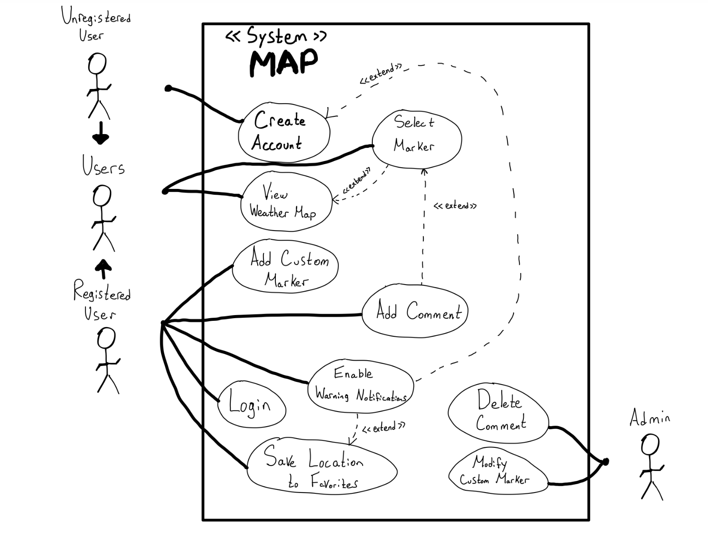

### **3.2. Actors Description**

1. **[Unregistered User]**: Unregistered Users can interact with the map to get information about the weather conditions in their area. These users can also view weather event markers, custom User markers,  read comments, and become Registered Users.
2. **[Registered User]**: Registered Users can interact with the app with all the same privileges as an Unregistered User, but can also enable push notifications, create comments, add custom markers (e.g., safehouses, resource points, dangers), and save locations.
3. **[Admin]**: Admins have the capacity to manage comments by removing or modifying unwanted comments, as well as manually modifying weather events.

### **3.3. Functional Requirements**

<a name="fr1"></a>

   - **Overview**:
      1. **Create Account**
      2. **Select Marker**
      3. **Add Custom Marker**
      4. **Add Comment**
      5. **Save Location to Favorites**
      6. **Enable Warning Notifications**

1. **[Create Account]**
      - **Description**: Unregistered Users can create an account using their Google Account. Once Registered, they become Registered Users.
      - **Primary actor(s)**: Unregistered Users
      - **Main success scenario**:
         1. Unregistered User clicks on the "Profile" icon.
         2. User is redirected to "Sign in" page, where they are prompted to login.
         3. User provides Google Credentials.
         4. User can input personal information to finish account creation.
         5. System validates the information and creates an account.
      - **Failure scenario(s)**:
         - 3a. Google authentication fails.
            - 3a1. System displays an error message: "There was an issue verifying your credentials. Please try again later."
            - 3a2. User is redirected to the Sign In screen.
         - 3b. User exits during sign-in process.
            - 3b1. User returns to "Sign In" page and a message is displayed stating "Please create a profile to personalize your experience."
         - 4a. User does not input all required fields
            - 4a1. Required fields highlighted, profile changes not saved or reflected server-side.
         - 5a. System fails to save profile information.
            - 5a1. System displays an error message: "Account creation failed. Please try again later."
2. **[Select Marker]**:
   - **Description**:All Users (Unregistered and Registered) can click on weather event or user markers on the map to view detailed information about the marker, including the danger score.
   - **Primary actor(s)**: Unregistered Users, Registered Users
   - **Main success scenario**:
     1. User clicks on a marker on the map.
     2. System displays a pop-up with details (e.g., type, location, danger score).
     3. User can close the pop-up by clicking outside it or a "Close" button.
   - **Failure scenario(s)**:
     - 2a. Danger score calculation fails.
       - 2a1. System displays a placeholder message: "Danger score unavailable."
       - 2a2. Marker details are displayed without the danger score.
3. **[Add Custom Marker]**:
   - **Description**: Registered Users can add custom markers to the map for safehouses, resource points, or dangers. These markers are visible to all users.
   - **Primary actor(s)**: Registered Users
   - **Main success scenario**:
     1. User clicks the "Add Marker" button.
     2. User places the marker on the map.
     3. User selects a marker type (safehouse, resource point, danger) and enters a short description.
     4. User selects "Create Marker"
     5. System saves the marker and displays it on the map.
   - **Failure scenario(s)**:
     - 1a. User is not Registered.
        - 1a1. System displays an error message: "You must be logged in to add markers."
        - 1a2. User is redirected to the login screen.
4. **[Add Comment]**:
   - **Description**: Registered Users can add comments to weather events or user marker to share important information about to the public. 
   - **Primary actor(s)**: Registered Users
   - **Main success scenario**:
     1. User clicks on a marker.
     2. User types a comment in the text box and clicks "Submit."
     3. System saves the comment and displays in the marker's comment section.
   - **Failure scenario(s)**:
     - 2a. User is not Registered.
       - 2a1. System displays an error message: "Please sign-in to comment."
       - 2a2. Comment is not added to the marker.
     - 3a. Comment contains offensive language.
       - 3a1. System displays an error message: "Comment contains inappropriate content. Please revise."
       - 3a2. User is prompted to edit the comment.
5. **[Save Location to Favorites]**:
   - **Description**: Registered Users can save specific locations on the map to their "Favorites" list for easy access later. "Favorites" can also be used to receive notifications in case of danger.
   - **Primary actor(s)**: Registered Users
   - **Main success scenario**:
     1. User clicks on a location on the map.
     2. User clicks the "Save to Favorites" button.
     3. System saves the location to the user's Favorites list.
     4. User receives a confirmation message: "Location saved to Favorites."
   - **Failure scenario(s)**:
     - 2a. User is not Registered.
       - 2a1. System displays an error message: "You must be logged in to save locations."
       - 2a2. User is redirected to the login screen.
     - 3a. Location save fails.
         - 3a1. System displays an error message: "Failed to save location. Please try again later."
         - 3a2. User is prompted to retry the action.
6. **[Enable Warning Notifications]**:
   - **Description**: Registered Users can enable push notifications to receive alerts about extreme weather events in their area.
   - **Primary actor(s)**: Registered Users
   - **Main success scenario**:
     1. User navigates to the "Profile" page.
     2. User clicks the "Enable Notifications" button.
     3. System prompts the user to enable location services.
     4. User enables location services and push notifications.
     5. System registers the user for notifications and confirms: "Notifications enabled"

   - **Failure scenario(s)**:
     - 2a. User has not completed profile creation.
         - 2a1. System displays a message prompting User to complete profile creation.
         - 2a2. User is not prompted to enable any permissions.
     - 3a. User declines to enable location services.
         - 3a1. System displays an error message: "Location services are required for notifications".
         - 3a2. User is prompted to enable location services in their device settings.
     - 4a. User declines to enable push notifications.
         - 4a1. System displays an error message: "Please enable notifications for up to date weather info".
         - 4a2. User is prompted to enable push notifications in their device settings.


7. **[Delete Comment]**:

   - **Description**: Admins have the capacity to delete comments
   - **Primary actor(s)**: Admin
   - **Main success scenario**:

     1. Admin clicks on marker
     2. Admin can click delete comment button
     3. Admin gets a confirmation message

   - **Failure scenario(s)**:
      - 2a. Server is unavailable
         - System displays an error message: "Server failed to remove message, please refresh and try again"

8. **[Modify Custom Marker]**:

   - **Description**: Admins have the ability to modify Custom Marker information
   - **Primary actor(s)**: Admin
   - **Main success scenario**:

     1. Admin clicks on custom marker
     2. Admin can choose to modify location, description, support information, etc.
     3. Admin edits respective section
     4. Admin confirms edits and the weather ping is updated for all users


   - **Failure scenario(s)**:
      - 4a. Admin attempts to enter an empty edit
         - 4a1. Error is returned, displaying the text "Edits must not be empty, please enter content"
         - 4a2. Edits are not updated for all users, and the Admin can continue to edit.


### **3.4. Screen Mockups**

1. **App Icon**


2. **Create Account**

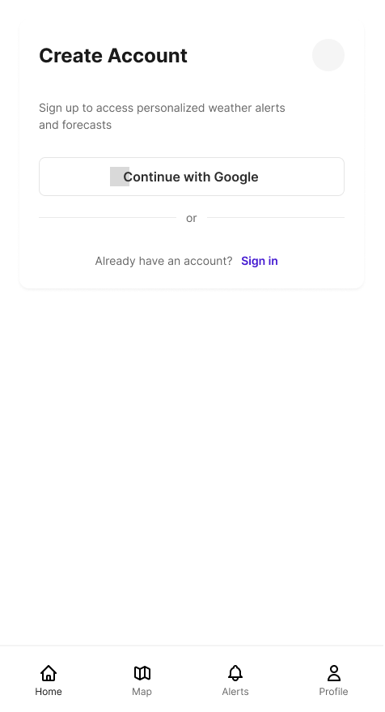

3. **Profile**

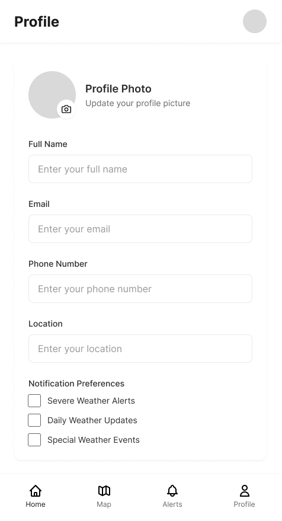

4. **Home**

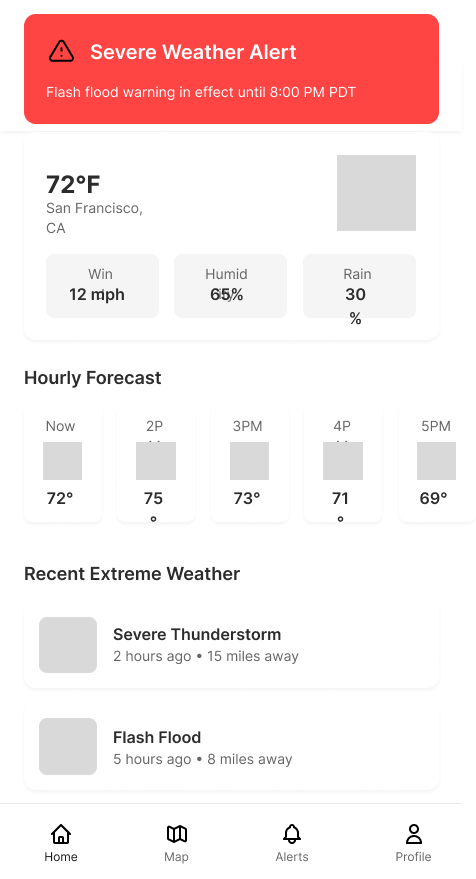

5. **Map**

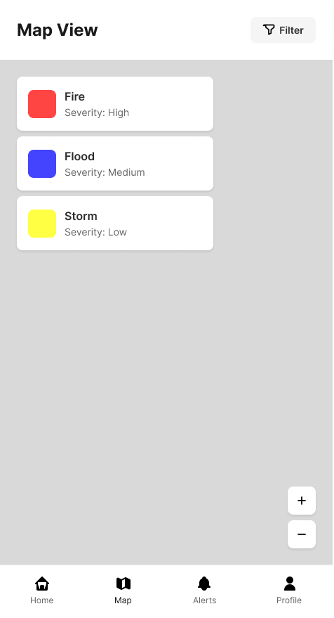

6. **Alert**

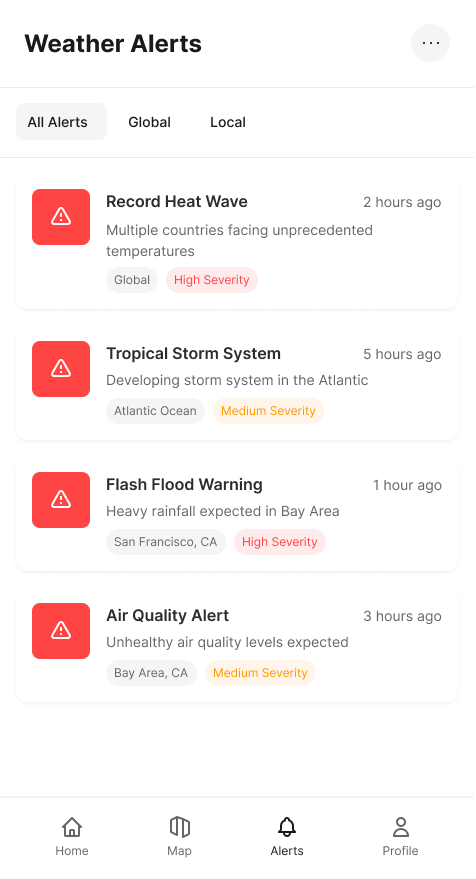

### **3.5. Non-Functional Requirements**

<a name="nfr1"></a>

1. **[Accessibility Compliance]**
   - **Description**:The app must comply with WCAG 2.1 Level AA accessibility standards, ensuring it is usable by individuals with disabilities (e.g., screen reader compatibility, color contrast, keyboard navigation).
   - **Justification**: WCAG 2.1 Level AA is a globally recognized standard for accessibility. Compliance ensures the app is inclusive and usable by individuals with disabilities, such as visual impairments or motor disabilities. This is critical for ensuring equitable access to life-saving weather information. [usability, inclusivity]
2. **[User Privacy]**
   - **Description**: The app must encrypt all user data (e.g., account information, saved locations) both in transit and at rest, and comply with GDPR and CCPA regulations.
   - **Justification**: Users trust the app with sensitive information, and robust security measures are necessary to protect their privacy and comply with legal requirements. [security, compliance]
3. **[Ease of Use]**
   - **Description**: The app must gracefully handle errors (e.g., network failures, server downtime) and provide users with clear instructions for recovery (e.g., retry options, offline mode).
   - **Justification**: The ISO 25010 Standard for Software Quality highlights the importance of error handling and recovery in ensuring system reliability. Clear error messages and recovery options reduce user frustration and ensure the app remains usable even during failures. [usability, reliability]

## 4. Designs Specification

### **4.1. Main Components**

1. **User**

   - **Purpose**: The user component manages user registration, retrieval, and metadata storage. It allows users to create accounts and retrieve their details.
   - **Rationale**: This component is essential for creating and managing user identities, enabling personalized interactions and notifications within the app.
   - **Interfaces**:
     1. POST /user
        - **Purpose**: Creates a new user with metadata such as name, location, email, registration token, and notification preferences.
        - **Parameters**: 
            - *user_ID*(String): user_ID generated by the server. Can be null.
            - *name*(String): The user's name.
            - *location*(String): The user's location.
            - *account_type*(String): The type of account (e.g., Registered, Admin).
            - *latitude*(Double): The latitude of the user's location.
            - *longitude*(Double): The longitude of the user's location.
            - *email*(String): The user's email address.
            - *regToken*(String): The registration token for authentication.
            - *notifications*(Boolean): Whether the user has enabled notifications.
         - **Return Value**: User object with new user details.
            
     2. GET /user/{user_id}
         - **Purpose**: Retrieves the details of a specific user by their unique ID.
         - **Parameters**:
            - *user_id*(String): The unique ID of the user.
         - **Return Value**: User object with new user details.

      2. GET /user/location
         - **Purpose**: Retrieves the details of a specific user by their unique ID.
         - **Parameters**:
            - *user_id*(String): The unique ID of the user.
            - *name*(String): The Location name.
            - *description(String): Description of saved location
            - *latitude*(Double): The latitude of the user's location.
            - *longitude*(Double): The longitude of the user's location.
         - **Return Value**: 'User location updated successfully'

2. **Map**

   - **Purpose**: The map component provides functionality to retrieve and display weather events and their details globally. Also controls Custom Markers.
   - **Rationale**: This component is necessary to provide users with a visual representation of extreme weather events and their associated data.
   - **Interfaces**:
     1. GET /event
         - **Purpose**: Retrieves a list of all weather events stored in the database.
         - **Parameters**: None.
         - **Return Value**: List<WeatherEvent> containing all weather events.
      2. POST /event/custom
         - **Purpose**: Post a new custom marker event to the database
         - **Parameters**: 
            - *Latitude*(Double): latitude of new marker
            - *Longitude*(Double): longitude of new marker
            - *Type*(String): The type of marker as a string
         - **Return Value**: List<Markers> containing all Markers
      
   

3. **Comment**

   - **Purpose**: The comment component allows users to post, retrieve, and delete comments on specific weather events.
   - **Rationale**: This component enables user interaction with weather events by allowing them to share and manage comments.
   - **Interfaces**:
      1. POST /comment/{event_id}
         - **Purpose**: Posts a new comment on a specific weather event.
         - **Parameters**:
            - *event_id*(String): The unique ID of the weather event.
            - *comment*(String): The comment text.
            - *user*(String): The user posting the comment.
         - **Return Value**: Updated WeatherEvent object with the new comment.

      2. GET /comment/{event_id}
            - **Purpose**: Retrieves all comments for a specific weather event.
            - **Parameters**: None.
               - *event_id*(String):The unique ID of the weather event.
            - **Return Value**: List<Comment> containing all comments for the event.

      3. DELETE /comment/{event_id}
            - **Purpose**: Deletes a specific comment from a weather event.
            - **Parameters**: None.
               - *event_id*(String): The unique ID of the user.
               - *comment_id*(String): The comment text.
            - **Return Value**: Updated WeatherEvent object with the comment removed.

4. **Weather**
   - **Purpose**: The weather component periodically fetches and updates weather event data from external APIs and stores it in the database.
   - **Rationale**: This component ensures that the app has up-to-date weather information for all users, reducing redundant API calls and providing a single source of truth.
   - **Interfaces**:
      1. POST /test_cron
            - **Purpose**: Triggers a manual update of weather event data by fetching from external APIs and storing it in the database.
            - **Parameters**: None.
               - *event_id*(String): The unique ID of the user.
               - *comment_id*(String): Success or error message.
            - **Return Value**: Updated WeatherEvent object with the comment removed.

5. **Notification**
   - **Purpose**: The notification component is responsible for delivering alerts and updates to users. 
   - **Rationale**: By decoupling notification logic, the app can support multiple notification channels and enhance scalability.
   - **Interfaces**: Enabling push notifications will send a request to the server, updating your status as a user that would like to receive notifications. To make the notification system easy to demonstrate, you can see the notifications you would receive based on your danger level by saving your profile.
      
### **4.2. Databases**

**Technologies**

1. **File Based Storage (S3)**
   - **Purpose**: Store sterilized and filtered training data
2. **NoSQL (Dynamo DB)**
   - **Purpose**: Store user information, weather, comments, notifications and other application data

**Database Schemas**

1. **Weather DB**
   - **Purpose**: Storing all extreme weather information to populate the map including comments
2. **User DB**
   - **Purpose**: Store the username, name, role, email, notifications settings, and markers

### **4.3. External Modules**

1. **[Google Maps](https://developers.google.com/maps)**
   - **Purpose**: Display map data for the app
2. **[Google Authentication](https://developer.android.com/identity/sign-in/credential-manager-siwg)**
   - **Purpose**: Handle Sign In with Google
3. **[NASA Fire Information for Resource Management System](https://firms.modaps.eosdis.nasa.gov/api/)**
   - **Purpose**: Collect wild fire information from NASA
4. **[Open Weather](https://openweathermap.org/api)**
   - **Purpose**: Provides weather meta data
5. **[Ambee](https://www.getambee.com/)**
   - **Purpose**: Proprietary climate and environmental data 
6. **[AWS Lambda](https://aws.amazon.com/lambda/)**
   - **Purpose**: Used to build serverless functions and pipelines to access certain modules/APIs
7. **[AWS API Gateway](https://aws.amazon.com/api-gateway/)**
   - **Purpose**: Used to create HTTPS API methods for frontend access
8. **[Firebase Cloud Messaging](https://console.firebase.google.com/)**
   - **Purpose**: Used to implement push notifications
9. **[Map Box](https://www.mapbox.com/)**
   - **Purpose**: Map and location rendering for events


### **4.4. Frameworks**

1. **[AWS]**
   - **Purpose**: Our cloud service provider will host the database, file storage, and backend
   - **Reason**: We feel comfortable with AWS due to past industry experience working with AWS
2. **[Express.js]**
   - **Purpose**: Our backend framework for APIs, authorization, and request handling
   - **Reason**: Due to our past experience and industry standard working with Express.js
3. **[DynamoDB (NoSQL)]**
   - **Purpose**: Used to store event and user information
   - **Reason**: Due to the unstructured nature of event data information and the ability to quickly make changes to the data stucture as opposed to SQL

### **4.5.1 Dependencies Diagram**

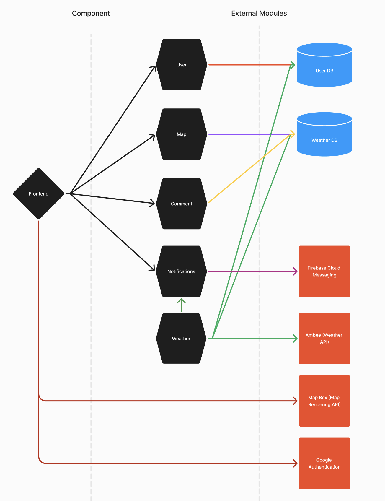

### **4.5.2 Cloud Architecture**

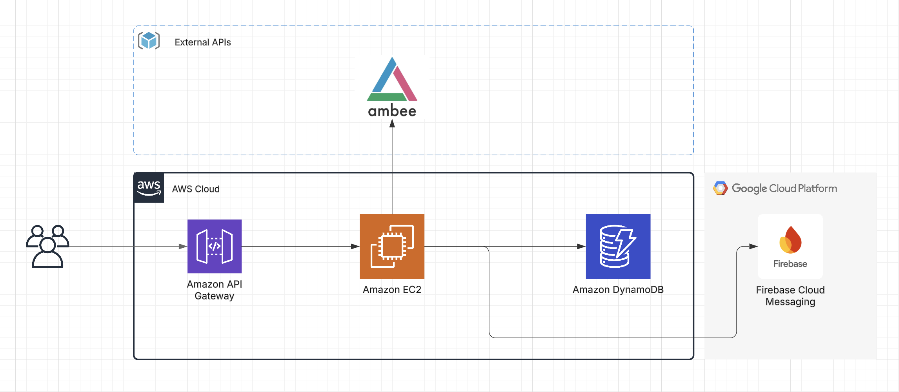

### **4.6. Functional Requirements Sequence Diagram**

1. [**Create Account**](#fr1)

      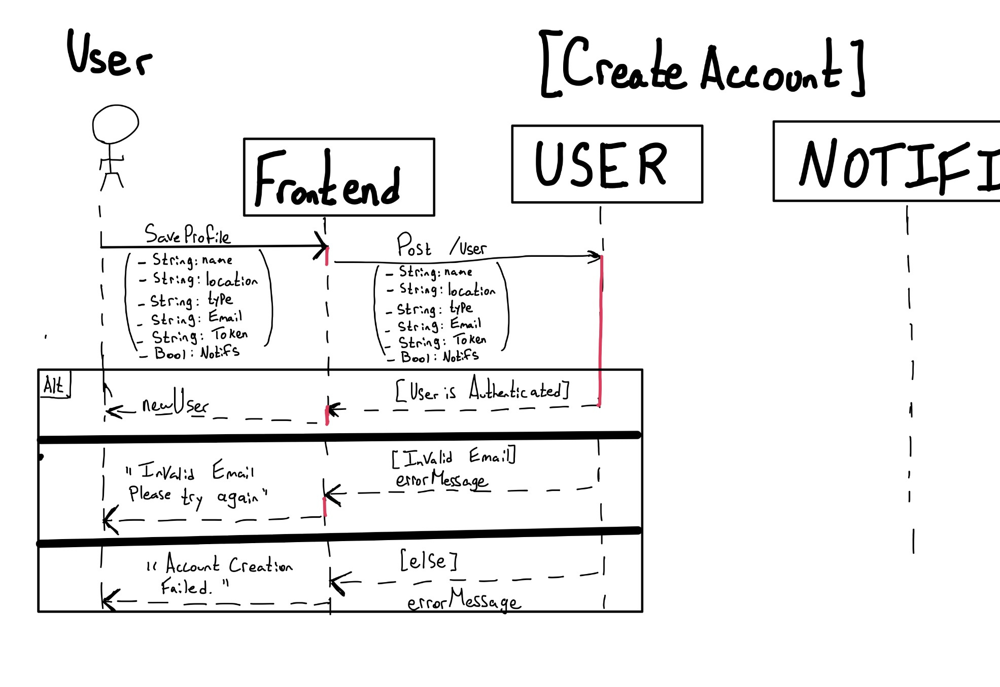
2. [**Add Comment**](#fr1)

      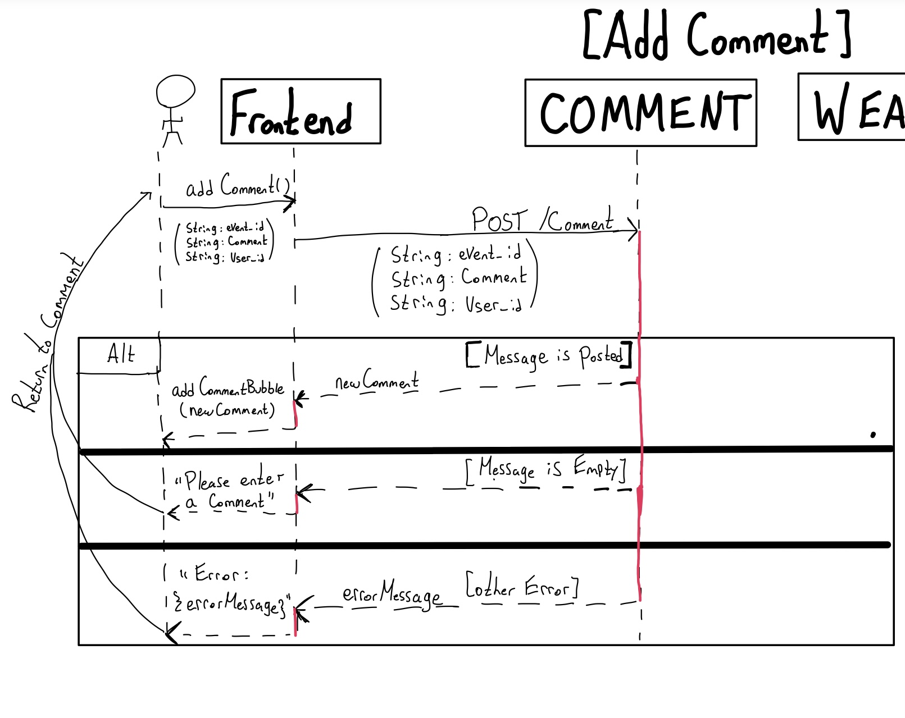
3. [**Select Marker**](#fr1)

      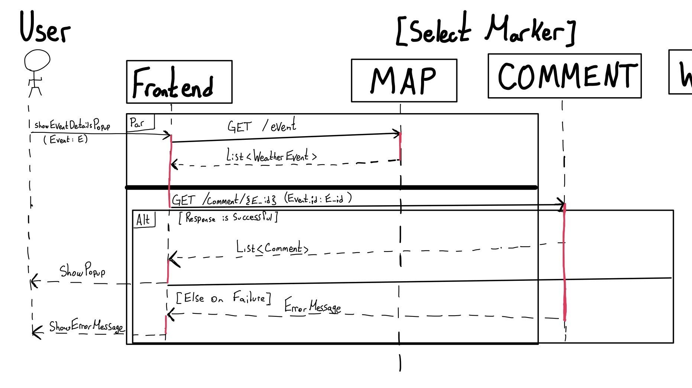
4. [**Add Custom Marker**](#fr1)

      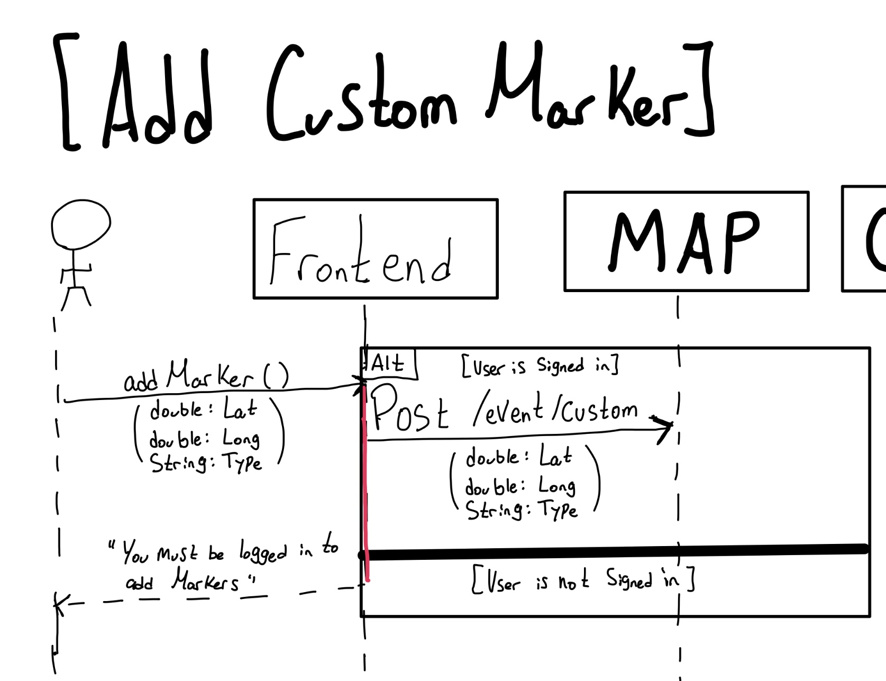
5. [**Save Location to Favorites**](#fr1)

      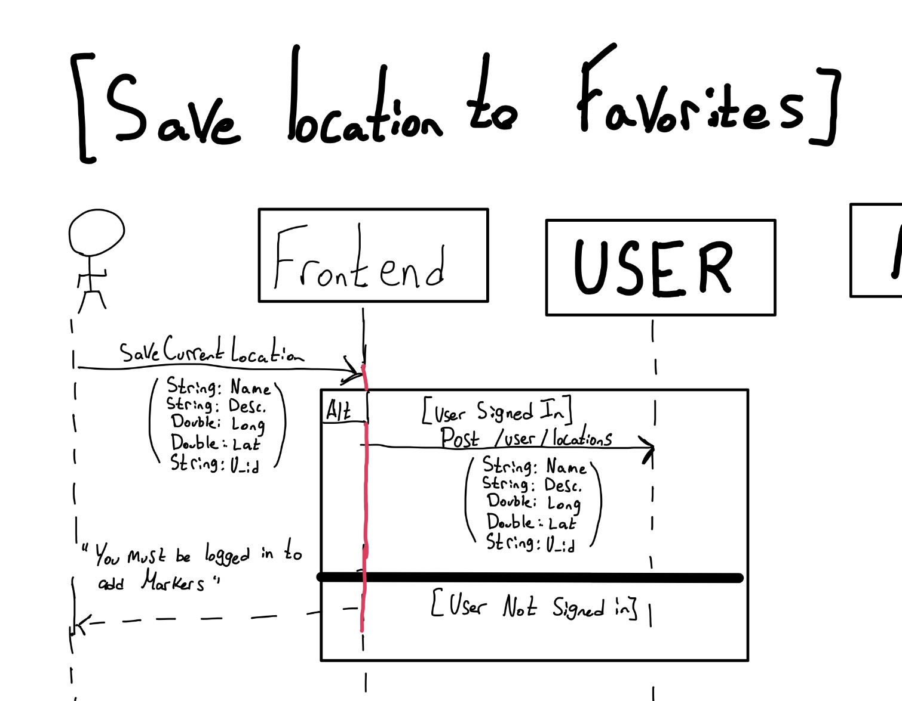
6. [**Enable Warning Notifications**](#fr1)

      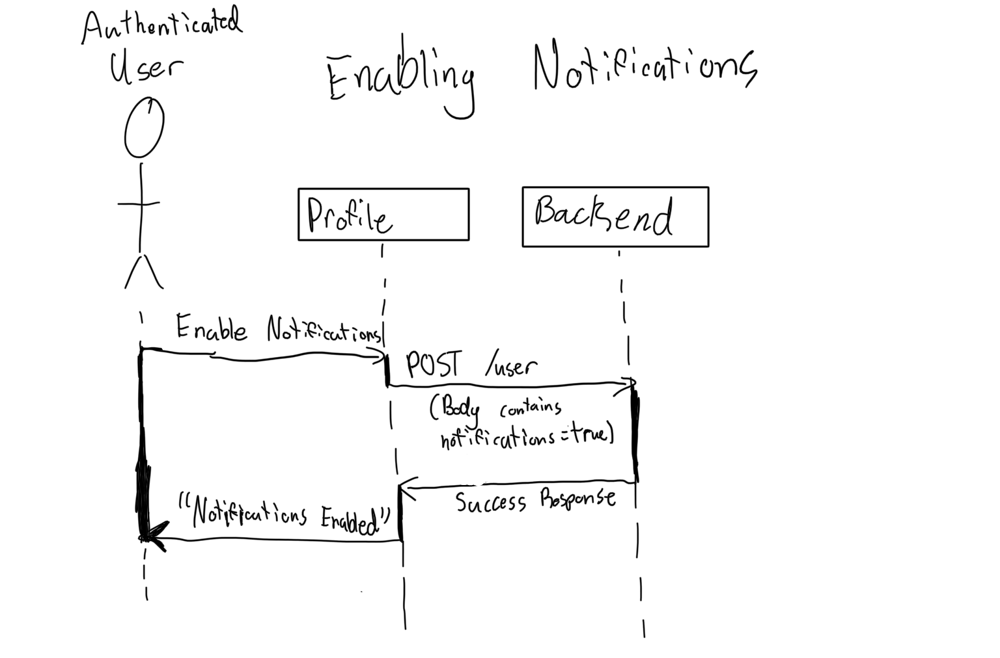

### **4.7. Non-Functional Requirements Design**

1. [**[Accessibility Compliance]**](#nfr1)
   - **Implementation Plans**: The app will be designed to work well for everyone, including people with disabilities. This means making sure the app works with screen readers, using colors that are easy to see, and allowing navigation using just a keyboard. We’ll also use tools to check that the app meets accessibility standards during development.
   - **Testing Approach**: 
      - Use automated testing tools like Lighthouse and Axe to scan the app for accessibility issues (e.g., color contrast, missing ARIA labels).
      - Conduct manual testing with screen readers (e.g., NVDA, VoiceOver) to ensure all features are accessible.
      
2. [**[User Privacy]**](#nfr1)
   - **Implementation Plans**:The app will protect user data by encrypting it both when it’s stored and when it’s sent over the internet. We’ll also follow privacy laws like GDPR and CCPA, giving users control over their data (e.g., letting them delete their information if they want). Regular checks will be done to make sure the app stays secure.
   - **Testing Approach**: 
      - Conduct penetration testing to identify vulnerabilities in data storage and transmission.
      - Verify encryption implementation by inspecting data at rest (e.g., database encryption) and in transit (e.g., HTTPS).
      - Perform compliance audits to ensure GDPR and CCPA requirements are met, such as providing users with data deletion options.

3. [**[Ease of Use]**](#nfr1)
   - **Implementation Plans**: The app will handle errors gracefully, showing clear messages when something goes wrong (e.g., “No internet connection. Please check your settings.”). Users will also have options to retry or use the app offline. We’ll test these features with real users to make sure they’re easy to understand and use.
   - **Testing Approach**: 
      - Simulate network failures and server downtime to test error messages and recovery options.
      - Use A/B testing to refine error messages and ensure they are clear and actionable.


### **4.8. Main Project Complexity Design**

**Danger Score Algorithm**

- **Description**: The goal of the danger score is to provide users with a quick, easy-to-understand metric that tells them whether they are in immediate danger and should take action. It also enables the app to send targeted notifications to users with high danger scores, urging them to seek more information from local authorities.


- **How is it complex?**: Calculating the danger score is complex because it requires:

   - Real-time processing of multiple data sources (e.g., user location, weather event data).
   - Weighting and combining different factors (proximity, severity, event type) into a single, meaningful score.
   - Ensuring the score is accurate, reliable, and actionable for users.

- **Design**:
  - **Input**: 
      1. *Proximity to the event*: How close the user is to the weather event.
      2. *Expected danger of the event*: The severity of the event (e.g., a Category 5 hurricane is more dangerous than a Category 1).
      3. *Type of weather event:* Different events (e.g., wildfires, earthquakes, floods) have different levels of risk and urgency, as well as a proximity factor that changes.

  - **Output**: A danger score out of 100 (double) that indicates the level of risk to the user. The higher the score the more immediate danger the user is in.
  - **Main computational logic (Pseudo Code)**: 
  ```
  function calculate_danger_score(user_location, event):
    proximity = calculate_distance(user_location, event.location)
    severity = event.severity
    event_type_weight = get_event_type_weight(event.type)
    
    danger_score = (proximity * proximity_weight) + 
                   (severity * severity_weight) + 
                   (event_type_weight * type_weight)
    
    return normalize_score(danger_score)
  ```
- **Additional Considerations**:
   The algorithm will be optimized for real-time performance to ensure quick updates as the user’s location or weather conditions change.
   Notifications will be triggered for users with danger scores above a certain threshold (e.g., 7 or higher), prompting them to take immediate action.

## 5. Contributions

- Tareq Alansari: 
<ul>
M3: App design mockups (figma, onesignal, photoshop). Assisted in reviewing sections, and contributing to various sections.

M4: Bottom navigation bar UI (3 hrs), Danger score index (2 hrs), Profile fragment UI (2 hrs), Merge danger-score branch to main (1 hr), Mapbox design UI overhaul (zoom-in, popups, etc.) (6-8 hrs), Location saving functionality and interface (4 hrs),  User marker functionality and interface (3 hrs), Alert fragment UI (not implemented in MVP) (1 hrs).
</ul>

- Martin Tang: 
<ul>
M3: Designed the architecture and design for the product (4.1 - 4.5). Completed the M3_Reflections along with assigning and delegating weekly tasks for the team. In addition, explored external modules and APIs to leverage within the product. 

M4: Setup AWS Services: EC2, DyanomDB, IAM (5 hr), Created all backend endpoints with reverse proxy and TLS used for Tempest (10 hr), Setup cron weather job using Ambee Weather API (3 hr). Implemented the full-stack comment functionality for markers (5 hr), Completed the M4_Reflections file (2 hr), Updated sections 4.1 - 4.5 (2 hr), Created AWS architecture of our cloud stack (1 hr)
</ul>


- Miguel Menard: 
<ul>
M3: Project Description, Use Case Diagram, Functional Requirements 2-6,  Sequence Diagrams 1-6, Help in Non-Functional Requirements. 

M4: Connect to AMBEED weather API (5h), Connect Mapbox API to frontend (5h), Setup Coroutine for API fetching (1h), Click Listener for Weather Pings (3h), Add home Marker (1h), add Custom Marker (2h), Redesign Project Requirements (18h), additional organizational and miscellaneous code (10h)
</ul>

- Armaan Braich:
<ul>
M3: Wrote non-functional requirements and design. Assisted in writing main project complexity design, as well as determining key actors and use cases. Additionally wrote some of the functional requirements and flows. Helped to fix grammar issues.

M4: Designed and implemented the Google Sign-In and Authentication flow (6 hrs). Added notification support on the front and back-end (6 hrs). Updated ProfileFragment and /user endpoint to match new functionality (3 hrs). Updated notifications to trigger based on danger level (3 hrs). 
</ul>
