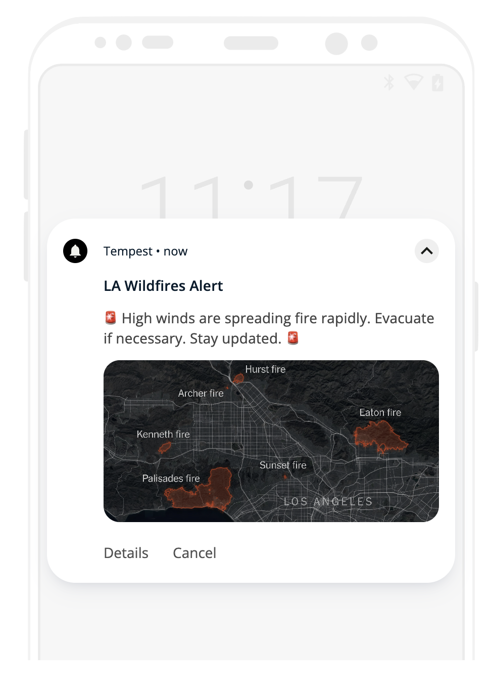
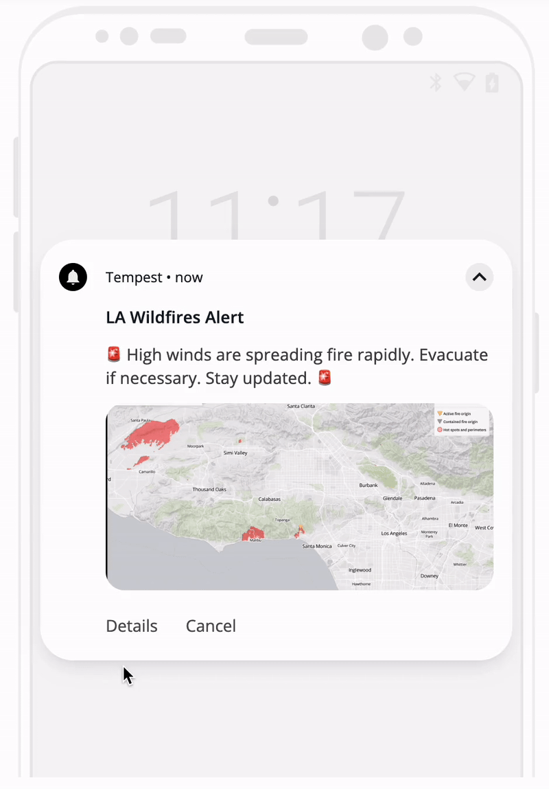
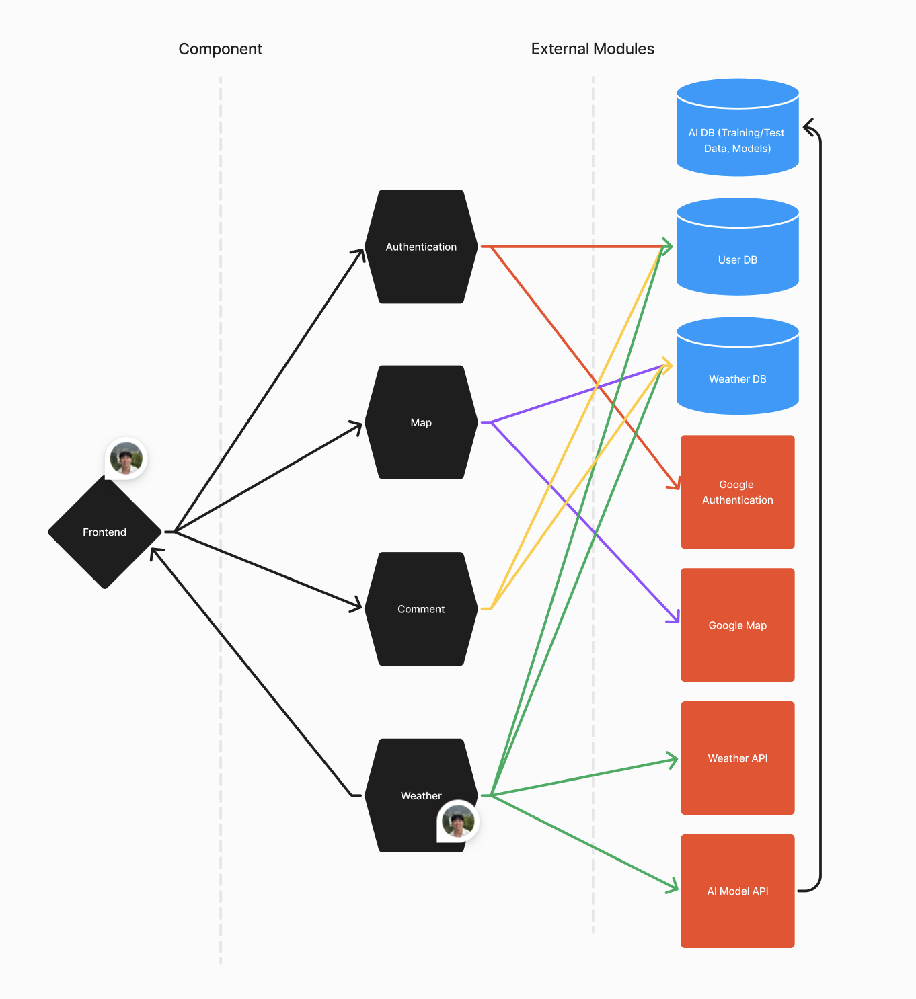
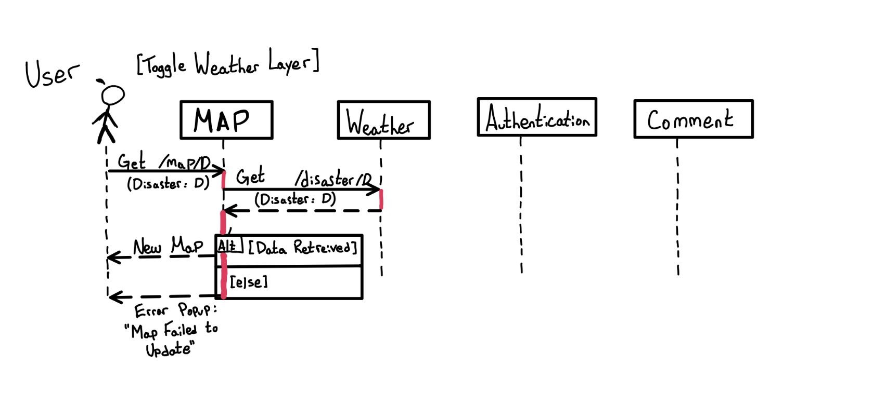
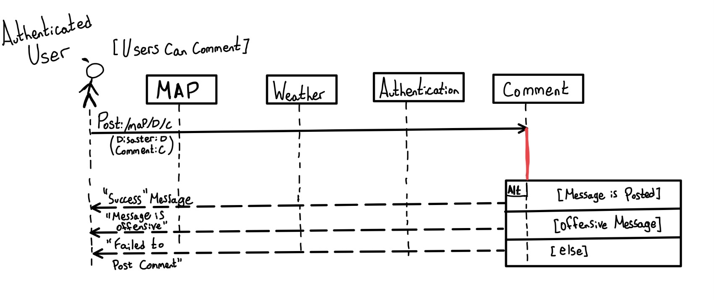
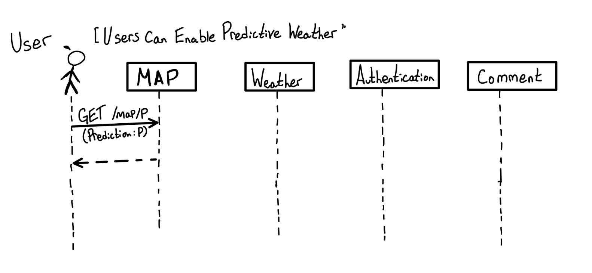
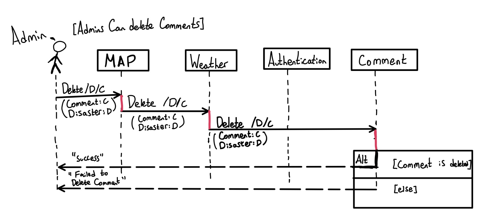
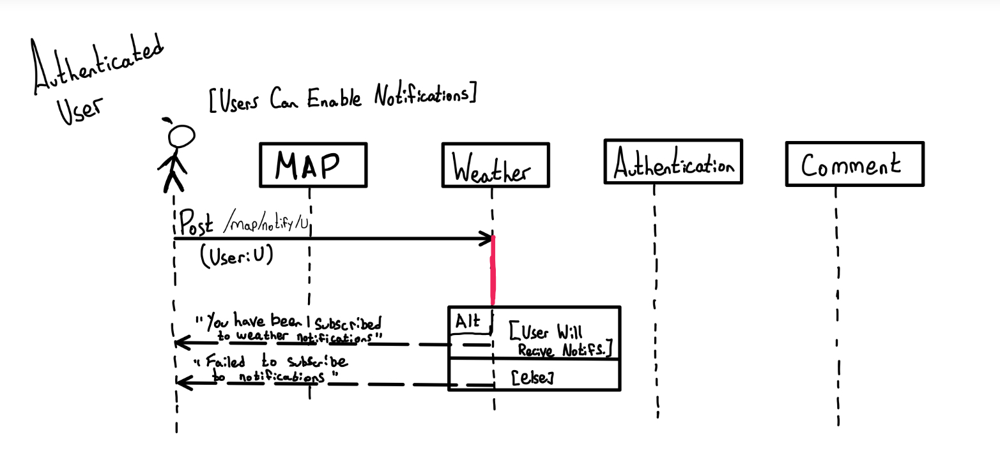

# M3 - Requirements and Design

## 1. Change History

<!-- Leave blank for M3 -->

## 2. Project Description

**Tempest** is a reimagined weather and news application designed to prioritize critical information about natural disasters, such as wildfires, tornadoes, hurricanes, and other intense weather.
The app delivers real-time updates and localized alerts for users to stay informed and prepared in the face of extreme weather events.

## 3. Requirements Specification

### **3.1. Use-Case Diagram**


### **3.2. Actors Description**

1. **[Unauthenticated User]**: Unauthenticated Users can interact with the map to get information about the weather conditions in their area. These users can also turn on predictive weather pathing, visualize different weather layers, and become Authenticated Users
2. **[Authenticated User]**: Authenticated Users can interact with the app with all the same priviliges as a User, but can also enable push notifications and create comments.
3. **[Admin]**: Admins have the capacity to manage comments by removing or modifying unwanted comments, as well as manually modifying weather events.

### **3.3. Functional Requirements**

<a name="fr1"></a>

1. **Users can create an account with localization information to be notified of extreme weather nearby**

   - **Overview**:

     1. Unauthenticated Users can create an account and authenticate with known platforms like Google and Facebook
     2. Users can toggle between different weather layers on the map to display different weather visualizations
     3. Authenticated Users can enable notifications for extreme weather in their area
     4. Authenticated Users can comment on extreme weather pings to add additional information
     5. Users can enable "predictive weather" which shows where the weather event is likely to go
     6. Admins can manage comments
     7. Admins can manage weather pings

   - **Detailed Flow for Each Independent Scenario**:
     1. **[Account Creation and Authentication]**:
        - **Description**: Unauthenticated Users can use Facebook or Google to authenticate and create an accoun
        - **Primary actor(s)**: Unauthenticated Users
        - **Main success scenario**:
          1. Users click on the "Login" button
          2. Users choose to authenticate with either Facebook or Google
          3. Users login with the respective service
          4. Users are redirected to the account page where they can enter a nickname for anonymity
          5. These users are now Authenticated Users
        - **Failure scenario(s)**:
          - 3a. The respective service returns a failed log in attempt
            - 3a1. The system catches the error
            - 3a2. The frontend shows a pop up telling the user the login failed

2. **[Toggling the Weather Layers]**:
   - **Description**: Users have the option to toggle between Wildfire Data, Tornado Data, Hurricane Data, or just the basic map.
   - **Primary actor(s)**: Unauthenticated Users, Authenticated Users
   - **Main success scenario**:
     1. Users selects which layer to toggle
     2. Map removes the previous visible layer, and displays the new selected animation on the screen.
   - **Failure scenario(s)**:
     - 2a. The animation is incorrectly displayed.
       - 2a1. The map will keep the previous layer visible
3. **[Authenticated Users can enable notifications for extreme weather in their area]**:

   - **Description**: Authenticated Users can go into their account and enable push notifications. They will need to accept to share their location information if they have not already.
   - **Primary actor(s)**: Authenticated Users
   - **Main success scenario**:
     1. User clicks on "enable local weather notifications" in their account
     2. User is prompted to enable location services
     3. User enables location services
     4. User is prompted to enable push notifications
     5. User enables push notifications
     6. The System registers the User as a subscriber to notifications in their location
   - **Failure scenario(s)**: - 2a. Users decline to enable location services - 2a1. A pop-up tells users location services are required to enable push notifications - 2a2. Steps 7 and 8 are skipped. - 2a3. A button to enable location services is now present in the Account page
     - 4a. Users decline to enable push notifications
       - 4a1. A pop-up tells users notifications help get users the most up-to-date information
       - 4a2. A button to enable push notifications is now present in the Account page

4. **[Authenticated Users can comment on extreme weather pings]**:
   - **Description**: Authenticated Users have the ability to leave messages on extreme weather to let others know about important information such as safe houses, supplies or other important knowledge in their vicinity. Users are able to read this information but cannot add their own information.
   - **Primary actor(s)**: Authenticated Users, Users
   - **Main success scenario**:
     1. Authenticated User clicks on the extreme weather event
     2. Authenticated User inputs text message in comment box
     3. User clicks on "Add Comment" button
     4. Comment is added to the extreme weather event ping
   - **Failure scenario(s)**:
     - 2a. User inputs offensive message
       - 2a1. An error will appear next to the text box saying "Warning! The comment contains offensive language. Please change the comment"
     - 2b. User inputs no message
       - 2b1. An error will appear next to the text box saying "Please input a message in the text box to comment"
     - 4a. The comment does not reach the server
       - 4a1. An error will appear next to the text box saying "Message could not reach server, please try again later"
5. **[Users can enable "predictive weather" which shows where the weather event is likely to go]**:

   - **Description**: Users can check a box on the map that allows them to see future movement of the exreme weather event they are currently on. This works for Wildfire Spreading, Tornado direction, and Hurricane direction.
   - **Main success scenario**:
     1. User clicks on "Enable Predictive Weather" button
     2. A blue checkbox will appear to show the overlay is activated
     3. The Map adds a new overlay on top of the current layer without removing the current layer.
   - **Failure scenario(s)**:
     - 1a. The overlay does not appear
       - 1a1. An error will pop up saying "Failed to load predicitve analysis data, please follow your local authority guidelines."

6. **[Admins can remove comments]**:

   - **Description**: Admins have the capacity to remove messages from the list of messages on any given extreme weather event if they deem them inappropriate
   - **Main success scenario**:

     1. Admin clicks on extreme weather event ping
     2. Admin finds inappropriate comment
     3. Admin can choose to delete a comment by clicking on a button, displaying a confirmation prompt
     4. Admin confirms they would like to delete the comment by answering affirmatively to the prompt
     5. Comment is deleted

   - **Failure scenario(s)**:
     - 5a. Comment is not deleted
       - 5a1. An error is returned saying "Failed to delete comment, please try again soon."
       - 5a2. Error is logged to manually review

7. **[Admins can manage weather pings]**:

   - **Description**: Admins have the capacity to edit and manually change weather event pings
   - **Main success scenario**:

     1. Admin clicks on extreme weather event ping
     2. Admin can choose to modify location, description, support information, etc.
     3. Admin edits respective section
     4. Admin confirms edits and the weather ping is updated for all users

   - **Failure scenario(s)**:
      - 4a. Admin attempts to enter an empty edit
         - 4a1. Error is returned, displaying the text "Edits must not be empty, please enter content"
         - 4a2. Edits are not updated for all users, and the Admin can continue to edit.
      - 4b. Failure to confirm edits
         - 4b1. An error is returned saying "Failed to edit {section}, please try again soon."
         - 4b2. Error is logged to manually review

### **3.4. Screen Mockups**

1. **App Icon**


2. **Push Notification Mockup**


_push notification with static map concept._


_push notification with dynamic map concept._

### **3.5. Non-Functional Requirements**

<a name="nfr1"></a>

1. **[Notification Speed]**
   - **Description**: Users must receive notifications within one minute of the information being available.
   - **Justification**: When dealing with a natural disaster, it is important that users have access to the information as soon as possible to ensure maximum safety. [performance]
2. **[User Privacy]**
   - **Description**: No User's account information, other than nickname, will ever be accessible to any other User
   - **Justification**: Users have a right to not disclose private information such as email, name, etc. If users choose to set a nickname, only this will be displayed to other Users on the application [security]
3. **[Ease of Use]**
   - **Description**: A user must click a maximum of one time to view all information about a disaster
   - **Justification**: Users should be able to access information about a potential threat as quickly an easily as possible. Additionally, less clicks to get necessary information makes the app easier to interface with. [usability]

## 4. Designs Specification

### **4.1. Main Components**

1. **Authentication**

   - **Purpose**: The authentication component authenticates a user with their Google or Facebook accounts allowing them to become an “Authenticated User” actor in the app.
   - **Rationale**: This component in the application is used to create an identity for a user allowing them interact with social features and receive personalized integration
   - **Interfaces**:
     1. UserSession exchangeAuthorizationCode(String authorizationCode, String redirectUri);
        - **Purpose**: Exchanges the provided authorization code for access and ID tokens creating a user session
     2. boolean validateIdToken(String idToken);
        - **Purpose**: Validate the IdToken of the user
     3. String refreshAccessToken(String refreshToken);
        - **Purpose**: Refresh the access token
     4. void logoutUser(String userId);
        - **Purpose**: Logout a user using the userId

2. **Map**

   - **Purpose**: The map component displays extreme weather conditions globally where users can view, comment, and learn about resources on individual weather disasters
   - **Rationale**: This component is necessary to provide a visual interface for users to access accessible weather information. A map-based UI is more engaging and intuitive for users.
   - **Interfaces**:
     1. List<WeatherEvent> getExtremeWeatherEvents(Double latitude, Double longitude);
        - **Purpose**: Retrieves a list of extreme weather events based on location
     2. List<WeatherEvent> getMapExtremeWeatherEvents();
        - **Purpose**: Get all global extreme weather events to display on the map
     3. WeatherEventDetails getEventDetails(String eventId);
        - **Purpose**: Get individual event information from the database such as comments

3. **Comment**

   - **Purpose**: The comment component interact closely with the map component to allow comments to populate on the map and provide functionality to make and remove remarks.
   - **Rationale**: This component is necessary to provide users and admins with the ability to manage their own and all user's comments, respectively. By decoupling this from the Map component, it is easier to debug and manage commnets with a separate component
   - **Interfaces**:
     1. void postComment(String eventId, String userId, String comment);
        - **Purpose**: Post comment from a user on specific event
     2. List<Comment> getEventComments(String eventId);
        - **Purpose**: List specific comments of an event
     3. void removeEventComments(List<UUID> commentId);
        - **Purpose**: Remove all or an individual event commnets

4. **Weather**
   - **Purpose**: Backend component to update the weather database with predictive and AI weather capabilities. The component will call the weather API endpoint periodically retrieving the data so every user sees the same weather information. The component will also notify users of local extreme weather conditions through their communication method of choice
   - **Rationale**: The weather component is used to act as a central consolidation of weather information rather than having the frontend call the API for every user. This mitigates the number of API calls while creating a source of truth for weather information for all users. This gives flexibility of scalability and rate limiting the number of API calls.
   - **Interfaces**:
     1. void fitModel (Weather weatherInformation):
        - **Purpose**: Leverage the existing model and training data to fit the current weather predicting where the wildfire will be
     2. void updateWeatherDB (Weather weatherInformation):
        - **Purpose**: Update the Weather DB with the most recent weather information
     3. void notifyUser (String eventId, String userId):
        - **Purpose**: Notify a user with a specific event
     4. List<Users> checkLocalUsers (String eventId):
        - **Purpose**: Return a list of Users that is affect by the specified event

### **4.2. Databases**

**Technologies**

1. **File Based Storage (S3)**
   - **Purpose**: Store sterilized and filtered training data
2. **NoSQL (Dynamo DB)**
   - **Purpose**: Store user information, weather, comments, notifications and other application data

**Database Schemas**

1. **AI DB**
   - **Purpose**: Used to store training, test, and validation test split, as well as the model to fit future data
2. **Weather DB**
   - **Purpose**: Storing all extreme weather information to populate the map including comments
3. **User DB**
   - **Purpose**: Store the username, name, role, email

### **4.3. External Modules**

1. **[Google Maps](https://developers.google.com/maps)**
   - **Purpose**: Display map data for the app
2. **[Google Authentication](https://developer.android.com/identity/sign-in/credential-manager-siwg)**
   - **Purpose**: Handle Sign In with Google
3. **[NASA Fire Information for Resource Management System](https://firms.modaps.eosdis.nasa.gov/api/)**
   - **Purpose**: Collect wild fire information from NASA
4. **[Open Weather](https://openweathermap.org/api)**
   - **Purpose**: Provides weather meta data
5. **[Scikit-Learn](https://scikit-learn.org/)**
   - **Purpose**: Sterilize and build out our classification models
6. **[Pandas](https://pandas.pydata.org/)**
   - **Purpose**: Storing training, test data in native dataframes for manipulation and processing
7. **[AWS Lambda](https://aws.amazon.com/lambda/)**
   - **Purpose**: Used to build serverless functions and pipelines to access certain modules/APIs
8. **[AWS API Gateway](https://aws.amazon.com/api-gateway/)**
   - **Purpose**: Used to create HTTPS API methods for frontend access
9. **[Firebase Console](https://console.firebase.google.com/)**
   - **Purpose**: Used to implement push notifications

### **4.4. Frameworks**

1. **[AWS]**
   - **Purpose**: Our cloud service provider will host the database, file storage, and backend
   - **Reason**: We feel comfortable with AWS due to past industry experience working with AWS
2. **[Express.js]**
   - **Purpose**: Our backend framework for APIs, authorization, and request handling
   - **Reason**: Due to our past experience and industry standard working with Express.js

### **4.5. Dependencies Diagram**



### **4.6. Functional Requirements Sequence Diagram**

1. [**Create User Account**](#fr1)
   
2. [**User can Toggle between different Weather Events**](#fr1)
   
3. [**User can comment on specific Weather Event**](#fr1)
   
4. [**User can enable Weather Predictions**](#fr1)
   
5. [**Admin can Delete Comment**](#fr1)
   
6. [**Users can Enable Push notifications**](#fr1)
   

### **4.7. Non-Functional Requirements Design**

1. [**[Notification Speed]**](#nfr1)
   - **Validation**: We plan to use an event-driven architecture, where new incoming data will trigger a notification system. Additionally, we plan to scale the size and number of our servers to match demand.
2. [**[User Privacy]**](#nfr1)
   - **Validation**: No information except for the User's nickname will ever be exposed to anyone other than the user. No other Users will be able to view or access this information at any time.
3. [**[Ease of Use]**](#nfr1)
   - **Validation**: The app will open to the map, and from there any map ping can be clicked and all relevant information will be displayed. There will be no need to sign in or click anywhere else in order to view data on an extreme weather event.

### **4.8. Main Project Complexity Design**

**Wildfire path prediction**

- **Description**: Based on current wildfire data and location, we will attempt to compute the path of the wildfire data in the future.
- **Why complex?**: It's complex because this will involve highly advanced algorithms to predict fire line trajectory based on metadata (like wind direction, speed, etc.). It may also involve training a model to enhance prediction.
- **Design**:
  - **Input**: Current fire location, wind direction and speed
  - **Output**: Predicted direction of disaster
  - **Main computational logic (Pseudo Code)**: 
  ```
  for number_of_predictions:
      predicted_path <- wind_speed[fire_location] + wind_intensity[fire_location]
  ```
  This is a simple example of pseudo-code, but this algorithm will have to take in many other factors. This includes the shrubbery surrounding the area of the wildfire, changes in altitude and slopes, current temperature and humidity, regional firefighting resources, and more. We also plan to train and use an artifical intelligence model to more accurately predict disaster pathing.

## 5. Contributions

- Tareq Alansari: App design mockups (figma, onesignal, photoshop). Assisted in reviewing sections, and contributing to various sections.
- Martin Tang: Designed the architecture and design for the product (4.1 - 4.5). Completed the M3_Reflections along with assigning and delegating weekly tasks for the team. In addition, explored external modules and APIs to leverage within the product.
- Miguel Menard:
- Armaan Braich: Wrote non-functional requirements and design. Assisted in writing main project complexity design, as well as determining key actors and use cases. Additionally wrote some of the functional requirements and flows. Helped to fix grammar issues.
